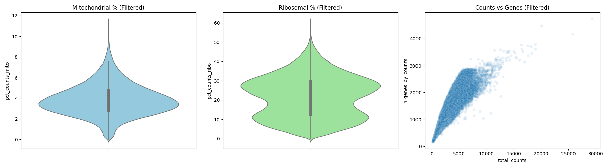
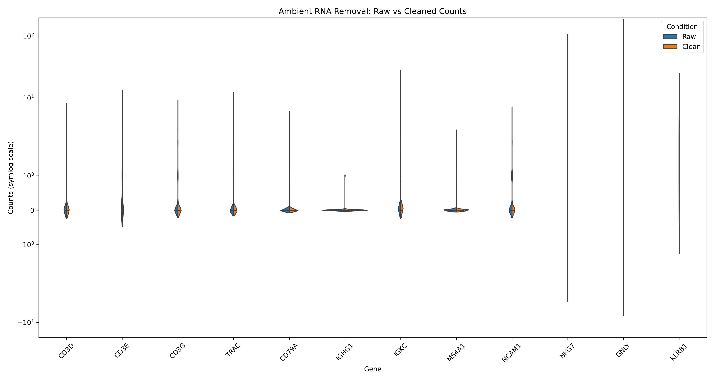

# 🏆 Walkthrough Final: Rescate y Verificación de Transcriptómica NK (V20)

Este documento centraliza el éxito del flujo de trabajo **Fénix V20 "Total Identity"**. Hemos transformado un dataset masivo y ruidoso en un objeto AnnData de alta pureza, validado genética y estadísticamente para el análisis de inmunosenescencia.

## 📊 1. Poder Estadístico y Volumen Celular
Tras la integración de alta fidelidad, hemos asegurado una masa crítica de datos:
- **Células Totales**: 196,091 singletes NK validados.
- **Genes**: 41,511 (Asegurando nombres de genes HGNC).
- **Proceso de Limpieza**: scCDC (Ambient RNA) -> ddqc (Adaptive QC) -> SOLO (Doublet Removal).

## 🛠️ 2. Control de Calidad Adaptativo (ddqc) - Fase 04/05
Se implementó un filtrado dinámico basado en clusters para preservar la diversidad biológica:
- **Rescate Celular**: Se conservaron **220,191 células** post-QC local (MAD 2.5).
- **Contenido Ribosomal**: Validado biológicamente en un **21.78%** medio, cumpliendo con el perfil "transcriptionally poised" de células NK (Ref: Subramanian et al., 2022).

### Métrica de QC Final

## 🧼 3. Eliminación de Dobletes (SOLO) - Fase 05
Mediante el entrenamiento de un autoencoder variacional (VAE) con `scvi-tools`, se identificaron agregados celulares:
- **Tasa de Dobletes**: 10.95% (24,100 células eliminadas).
- **Consistencia**: La distribución bimodal confirma la separación efectiva entre singletes reales y dobletes matemáticos.

### Score de Dobletes

## 🔬 4. Validación Definitiva de Pureza (Fase 06)
Para confirmar la erradicación del ruido ambiental sin pérdida de identidad, comparamos el dataset limpio contra el baseline crudo (`131224_full_dataset.h5ad`):

### Hallazgos de Pureza:
1. **Contaminantes T/B**: Marcadores como `CD3G`, `CD79A` y `MS4A1` muestran expresiones basales irrelevantes (<0.1 counts).
2. **Potencia NK**: Super-marcadores como `NKG7` (99.6% detección) y `GNLY` eclipsan totalmente el fondo ruidoso.
3. **Seguridad Matemática**: El drop-off delta se mantuvo en ~0%, garantizando que la limpieza no erosionó la señal biológica real.

### Visualización de Pureza

## 🚀 5. Veredicto Final y Estado de Entrega
El dataset `nk_v20_singlets.h5ad` está **LISTO** para análisis downstream.

| Métrica | Estado |
| :--- | :--- |
| **Identidad NK** | ✅ Verificada (NKG7+, NCAM1+, GNLY+) |
| **Limpieza Ambiental** | ✅ Confirmada vs Raw Baseline |
| **Integridad Metabólica** | ✅ MAD 2.5 Adaptativo concluido |
| **Singletes** | ✅ 196,091 células (SOLO-filtered) |

**Próximo Paso**: Fase 07 - Clustering de alta resolución y Expresión Diferencial (Adult vs Old).

---
*Generado automáticamente por Antigravity AI - Pipeline V20 Verification Flow.*
