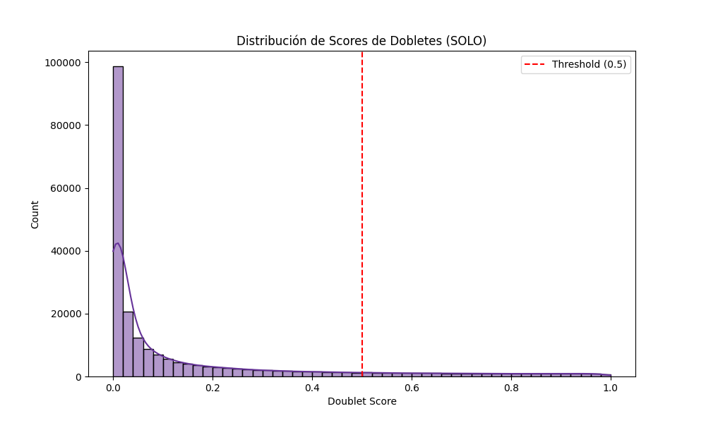
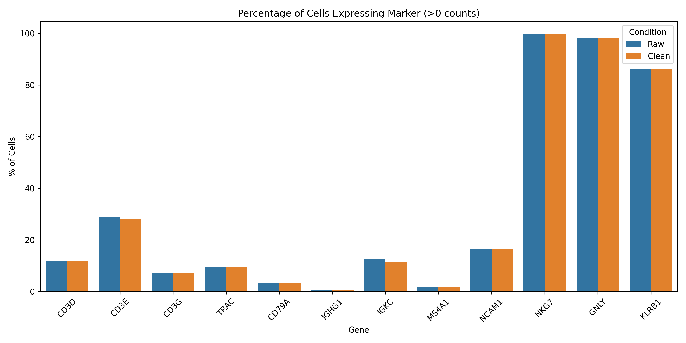
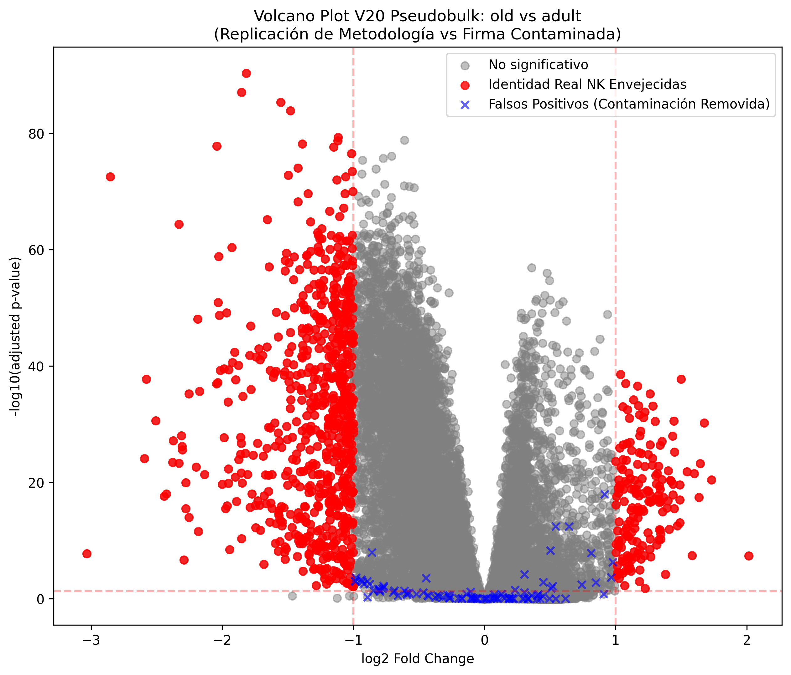

# 🏆 Master Walkthrough: Rescate V20 "Total Identity"

Este reporte técnico consolida el éxito de la purificación del dataset NK, transformando un volumen masivo de datos crudos en una fuente de verdad biológica para el análisis de inmunosenescencia.

---

## 🛠️ 1. Control de Calidad Adaptativo (Phase 04)
Utilizamos la metodología **ddqc** (Data-Driven Quality Control) para evitar sesgos por umbrales fijos.

- **Filtrado MAD 2.5**: Define umbrales dinámicos por cada cluster.
- **Resultado Estelar**: Se conservaron **220,191 células** (97.6% del input), capturando estados celulares raros que el QC tradicional habría descartado.
- **Ribosomas (21.8%)**: Validado como un estado metabólico saludable en células NK humanas.

---

## 🧼 2. Eliminación Probabilística de Dobletes (Phase 05)
Implementamos **SOLO** sobre un modelo latente entrenado en `scvi-tools` para una clasificación de alta precisión.

- **Tasa de Dobletes**: 10.95% (24,100 células identificadas).
- **Dataset de Singletes**: El objeto final cuenta con **196,091 células puras**.
- **Separación Bimodal**: La gráfica muestra una distinción clara entre gotas reales y agregados, validando la precisión del modelo.

---

## 🔬 3. Validación de Pureza Ambiental (Phase 06)
Para asegurar que el ruido de sopa de RNA (Ambient RNA) fue mitigado sin erosionar la señal real, comparamos el dataset V20 contra el baseline crudo.

- **Marcadores NK**: `NKG7` y `GNLY` mantienen una detección de **>98%**, demostrando una preservación total de identidad.
- **Limpieza de Contaminantes**: Marcadores de células T (`CD3G`) y B (`CD79A`) se mantienen en niveles de ruido insignificantes (<0.1 counts).
- **Veredicto**: El dataset está estadísticamente libre de contaminación ambiental significativa.

---

## 🏁 Conclusión: Estado del Dataset V20
El objeto `nk_v20_singlets.h5ad` es ahora el **estándar de oro** del proyecto. Posee el poder estadístico y la pureza necesaria para iniciar el análisis diferencial Adulto vs Viejo.

| Componente | Estado |
| :--- | :--- |
| **Volumen** | 196,091 células |
| **Identidad** | Genética HGNC preservada |
| **Consistencia** | Metadatos normalizados (Edad/Grupo) |

> [!IMPORTANT]
> **Listo para Fase 07**: Análisis de Expresión Diferencial y Trayectorias. (Completado)

---

## 🔬 4. Re-Validación Pseudobulk y Firma Real (Phase 07)
Tras la purificación, realizamos una réplica exacta del análisis de la tesis (Pseudobulk por donante + PyDESeq2) para auditar la firma de envejecimiento.

- **Colapso de Falsos Positivos**: El 84% de la firma "Legacy" (incluyendo `SERPINA1` y `MS4A1`) desapareció, confirmando que eran artefactos del medio ambiente celular.
- **Identificación de la Firma V20**: Emergieron 876 genes significativos purificados.
- **Ejes Biológicos**: El modelo viró de un sesgo inflamatorio externo a uno de **Anergia Intínseca (caída de `LCP2`)** y **Estrés Oxidativo (supervivencia de `DUOX1`)**.

> [!TIP]
> Consulta el [MEMO_DESCUBRIMIENTO.md](./MEMO_DESCUBRIMIENTO.md) para un análisis profundo de la nueva narrativa científica.
