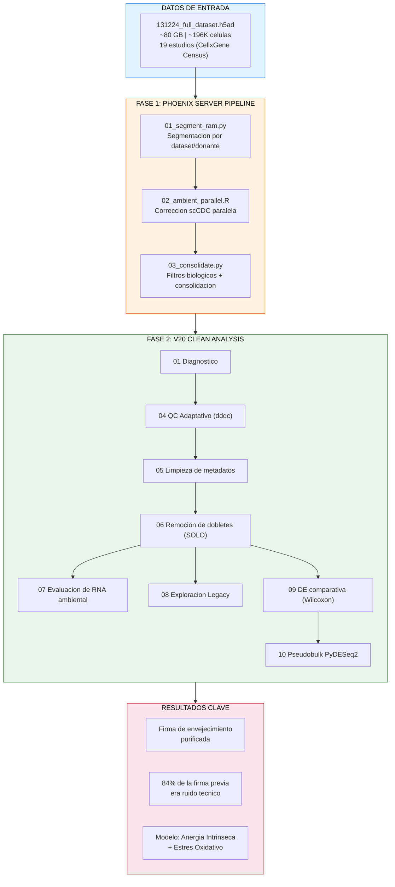

# Pipeline Overview: NK Cell Aging Transcriptomics (V20)

## Panorama general del proyecto

Este proyecto analiza el transcriptoma de celulas NK humanas para estudiar envejecimiento celular.
El dataset original (~80 GB, ~196K celulas) estaba contaminado con RNA ambiental de otras celulas (B, T, monocitos), lo que generaba falsos positivos en expresion diferencial.

El **Protocolo Fenix (V20)** rescata y purifica los datos en dos fases principales.



## Archivos de datos clave (flujo de transformacion)

```mermaid
flowchart LR
    A["131224_full_dataset.h5ad\n(~80 GB, raw)"] -->|PHOENIX| B["nk_total_reprocessed.h5ad\n(corregido scCDC)"]
    B -->|renombrado| C["nk_v20_master.h5ad\n(entrada al pipeline V20)"]
    C -->|04-adaptive-qc| D["nk_v20_filtered.h5ad\n(post ddqc)"]
    D -->|05-preprocessing| E["nk_v20_final.h5ad\n(metadatos limpios)"]
    E -->|06-doublet-removal| F["nk_v20_singlets.h5ad\n(dataset definitivo)"]

    style A fill:#ffcdd2,color:#000
    style F fill:#c8e6c9,color:#000
```



## Herramientas y librerias principales

| Herramienta | Lenguaje | Funcion |
|------------|----------|---------|
| scanpy | Python | Analisis de scRNA-seq |
| scVI / SOLO | Python | Modelo generativo + deteccion de dobletes |
| ddqc | Python | QC adaptativo por cluster (MAD) |
| PyDESeq2 | Python | Expresion diferencial pseudobulk |
| Seurat | R | Preprocesamiento (en PHOENIX) |
| scCDC | R | Deteccion/correccion de contaminacion |
| pegasusio | Python | Conversion de formatos (para ddqc) |

## Estructura del repositorio

```
NK_RNA_ambient_v2/
|-- PHOENIX_SERVER_DEPLOY/     <- Fase 1: pipeline de servidor
|   |-- run_server_pipeline.sh <- Punto de entrada
|   +-- src/                   <- Scripts 01-03
|
|-- V20_CLEAN_ANALYSIS/        <- Fase 2: analisis limpio
|   |-- scripts/               <- Pipeline numerado 01-10
|   |-- data/                  <- Archivos h5ad (no en git)
|   |-- docs/memory_logs/      <- Bitacora y reportes
|   +-- referencias/           <- Notebooks originales de referencia
|
|-- legacy_scripts/            <- Archivo historico ("Era Monster")
|-- results/                   <- Figuras y tablas finales
+-- docs/                      <- Documentacion y diagramas
```
