# PHOENIX Server Pipeline (Fase 1: Rescate de datos)

## Objetivo

El dataset original (~80 GB) contiene celulas de multiples tipos (NK, B, T, monocitos)
de 19 estudios publicos. El RNA ambiental de celulas no-NK contamina las cuentas,
generando falsos positivos en analisis de expresion diferencial.

PHOENIX se ejecuta en un servidor con alta RAM y multiples cores.
No requiere GPU.

## Diagrama de flujo detallado

```mermaid
flowchart TB
    subgraph ENTRADA["ENTRADA"]
        RAW["131224_full_dataset.h5ad\n~80 GB | Multiples tipos celulares\n19 estudios de CellxGene Census"]
    end

    subgraph FASE1["FASE 01: Segmentacion (Python)"]
        direction TB
        S1["Cargar metadata en modo backed\n(no carga la matriz completa a RAM)"]
        S2{"Numero de celulas\npor dataset_id?"}
        S3["> 40,000 celulas\n(Monster dataset)"]
        S4["<= 40,000 celulas\n(Normal)"]
        S5["Dividir por donor_id\ndentro del dataset"]
        S6["Escribir segmento\ncomo .h5ad individual"]

        S1 --> S2
        S2 -->|Monster| S3 --> S5 --> S6
        S2 -->|Normal| S4 --> S6
    end

    subgraph FASE2["FASE 02: Correccion scCDC (R, paralelo)"]
        direction TB
        C1["Leer cada segmento .h5ad"]
        C2["Convertir a objeto Seurat\n(CreateSeuratObject)"]
        C3{"Tiene columna\ncell_type?"}
        C4["Usar cell_type como clusters\n(agrupar raros en 'RareCells')"]
        C5["Clustering de novo\nNormalize -> HVG -> PCA -> Leiden"]
        C6["scCDC: ContaminationDetection()\nIdentifica genes contaminantes\npor cluster"]
        C7{"Se detectaron\ngenes contaminantes?"}
        C8["ContaminationCorrection()\nCorrige la matriz de cuentas"]
        C9["Guardar Seurat como .rds\n(sin correccion)"]
        C10["Guardar Seurat corregido\ncomo .rds"]

        C1 --> C2 --> C3
        C3 -->|Si| C4 --> C6
        C3 -->|No| C5 --> C6
        C6 --> C7
        C7 -->|Si| C8 --> C10
        C7 -->|No| C9
    end

    subgraph FASE3["FASE 03: Consolidacion (Python, paralelo)"]
        direction TB
        D1["Leer cada .rds desde R\n(Rscript bridge: RDS -> h5ad)"]
        D2["Extraer cuentas del assay\n(Corrected o RNA)"]
        D3["FILTROS BIOLOGICOS"]
        D3a["tissue == 'blood'\ndisease == 'normal'"]
        D3b["cell_type in NK types\nage > 34 anios"]
        D3c["Solo genes HGNC validos\n(patron: ^A-Z, sin ENSG/LOC/AC)"]
        D4["ETIQUETADO"]
        D4a["age_group: 'old' (>=60) vs 'adult'"]
        D4b["title/short_title del estudio"]
        D5["Concatenar todos los segmentos\n(ad.concat, join='outer')"]
        D6["nk_total_reprocessed.h5ad\n(Dataset maestro limpio)"]

        D1 --> D2 --> D3
        D3 --> D3a --> D3b --> D3c
        D3c --> D4 --> D4a
        D4a --> D4b --> D5 --> D6
    end

    ENTRADA --> FASE1
    FASE1 -->|"Segmentos .h5ad\n(~N archivos)"| FASE2
    FASE2 -->|"Segmentos .rds\n(corregidos)"| FASE3

    style ENTRADA fill:#e3f2fd,stroke:#1565c0,color:#000
    style FASE1 fill:#fff3e0,stroke:#e65100,color:#000
    style FASE2 fill:#f3e5f5,stroke:#6a1b9a,color:#000
    style FASE3 fill:#e8f5e9,stroke:#2e7d32,color:#000
```

## Detalle de cada script

### `01_segment_ram.py` - Segmentacion

| Aspecto | Detalle |
|---------|---------|
| **Entrada** | `131224_full_dataset.h5ad` (modo backed='r') |
| **Salida** | `data/processed/segments/*.h5ad` |
| **Logica** | Divide el dataset por `dataset_id`. Si un dataset tiene >40K celulas, lo subdivide por `donor_id` para evitar errores de memoria en scCDC |
| **Concepto clave** | `backed='r'` lee solo la metadata sin cargar la matriz completa (~80 GB) a RAM |

### `02_ambient_parallel.R` - Correccion de RNA ambiental

| Aspecto | Detalle |
|---------|---------|
| **Entrada** | `data/processed/segments/*.h5ad` |
| **Salida** | `data/processed/corrected/*.rds` |
| **Herramienta** | scCDC (ZJU-UoE-CCW-LAB) |
| **Paralelismo** | `mclapply` con `detectCores() - 4` nucleos |
| **Logica** | Para cada segmento: crea Seurat, define clusters (cell_type o de novo), ejecuta `ContaminationDetection()` que identifica genes cuya expresion proviene de celulas de otro tipo, y `ContaminationCorrection()` que ajusta las cuentas |
| **Concepto clave** | scCDC detecta genes como MS4A1 (marcador de celulas B) que aparecen en celulas NK por contaminacion ambiental, no por expresion real |

### `03_consolidate.py` - Filtrado biologico y consolidacion

| Aspecto | Detalle |
|---------|---------|
| **Entrada** | `data/processed/corrected/*.rds` |
| **Salida** | `data/processed/nk_total_reprocessed.h5ad` |
| **Filtros aplicados** | 1) Solo sangre periferica (`blood`) y condicion normal. 2) Solo tipos celulares NK (6 subtipos). 3) Solo individuos >34 anios. 4) Solo genes con simbolo HGNC valido |
| **6 subtipos NK aceptados** | natural killer cell, CD56dim, CD56bright, mature NKT, type I NKT, activated type II NKT |
| **Concepto clave** | El bridge R->Python usa `Rscript` para convertir .rds a .h5ad, preservando la capa `Corrected` si existe |
