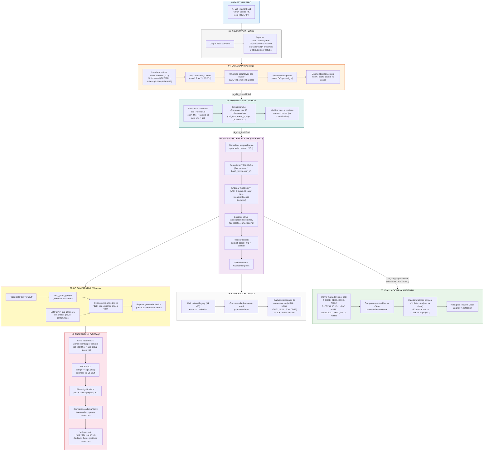
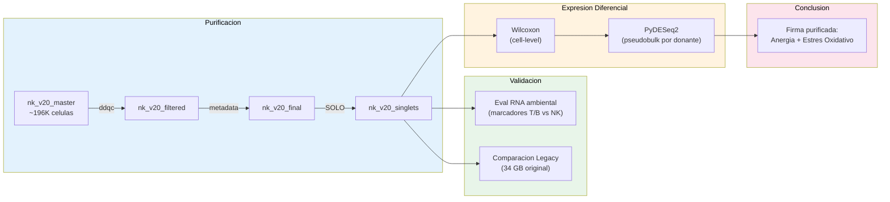

# V20 Clean Analysis Pipeline (Fase 2: Analisis y validacion)

## Objetivo

A partir del dataset rescatado por PHOENIX (`nk_v20_master.h5ad`), este pipeline
aplica control de calidad adaptativo, remueve dobletes, y ejecuta expresion diferencial
para comparar celulas NK de individuos viejos vs adultos.

El hallazgo principal: el 84% de la firma de envejecimiento del analisis previo ("dirty")
era contaminacion de RNA ambiental, no biologia real.

## Diagrama de flujo completo

## Diagrama simplificado: flujo de datos

## Detalle de cada script

### `01-diagnostic-report.py` - Reporte inicial

| Aspecto | Detalle |
|---------|---------|
| **Entrada** | `data/nk_v20_master.h5ad` |
| **Salida** | Reporte en consola (no genera archivos) |
| **Que reporta** | Total celulas/genes, distribucion old/adult, presencia de 6 marcadores NK (NKG7, NCAM1, FCGR3A, PRF1, GNLY, GZMB), top 5 estudios por volumen |

### `04-adaptive-qc.py` - QC con ddqc

| Aspecto | Detalle |
|---------|---------|
| **Entrada** | `data/nk_v20_master.h5ad` |
| **Salida** | `data/nk_v20_filtered.h5ad` + plots en `results/qc/` |
| **Metodo** | ddqc (data-driven QC): en lugar de usar umbrales fijos globales para mito%, usa clustering Leiden para definir umbrales por cluster con MAD (Median Absolute Deviation) |
| **Parametros** | Leiden res=1.5, k=15, 30 PCs, MAD threshold=2.5, min 100 genes |
| **Por que ddqc?** | Los umbrales fijos penalizan injustamente a clusters con biologia distinta. Por ejemplo, un cluster con alta actividad mitocondrial natural seria eliminado con un corte global de 10% mito |

### `05-preprocessing-metadata.py` - Limpieza de metadatos

| Aspecto | Detalle |
|---------|---------|
| **Entrada** | `data/nk_v20_filtered.h5ad` |
| **Salida** | `data/nk_v20_final.h5ad` |
| **Logica** | Renombra columnas (title -> donor_id, etc.), elimina columnas tecnicas redundantes, conserva solo 10 columnas esenciales, verifica que .X tenga cuentas crudas |

### `06-doublet-removal-solo.py` - Dobletes con scVI + SOLO

| Aspecto | Detalle |
|---------|---------|
| **Entrada** | `data/nk_v20_final.h5ad` |
| **Salida** | `data/nk_v20_singlets.h5ad` + plots en `results/doublets/` |
| **Paso 1** | Selecciona 7,000 HVGs con normalizacion temporal (no modifica .X original) |
| **Paso 2** | Entrena scVI (Variational Autoencoder): 2 layers, 30 dims latentes, distribucion Negative Binomial. Corrige batch effect por donor_id |
| **Paso 3** | SOLO usa el modelo scVI para generar dobletes sinteticos y entrenar un clasificador. 400 epochs con early stopping |
| **Criterio** | doublet_score > 0.5 AND doublet_score > singlet_score |
| **Por que SOLO?** | Es el gold standard para deteccion de dobletes en scRNA-seq. Usa el espacio latente de scVI para generar dobletes realistas |

### `07-evaluate-ambient-rna.py` - Evaluacion de contaminacion

| Aspecto | Detalle |
|---------|---------|
| **Entrada** | `data/nk_v20_singlets.h5ad` + `data/processed/segments/*.h5ad` (raw) |
| **Salida** | `results/evaluation/ambient_rna_metrics.csv` + violin/barplot PNGs |
| **Logica** | Compara cuentas raw vs clean para marcadores de contaminacion (CD3D/E para T, CD79A/MS4A1 para B, NKG7/GNLY para NK). Si la limpieza funciono, los marcadores T/B deben bajar y los NK deben mantenerse |

### `08-explore-legacy.py` - Comparacion con dataset original

| Aspecto | Detalle |
|---------|---------|
| **Entrada** | `referencias/scanvi_sin_adultos.h5ad` (~34 GB, backed) + `data/nk_v20_singlets.h5ad` |
| **Salida** | Reporte en consola |
| **Logica** | Lee el dataset legacy en modo backed (sin cargar a RAM completo), muestrea 10K celulas, compara expresion de marcadores de contaminacion |

### `09-comparative-de-analysis.py` - DE comparativa (Wilcoxon)

| Aspecto | Detalle |
|---------|---------|
| **Entrada** | `data/nk_v20_singlets.h5ad` |
| **Salida** | `results/comparative/dirty_vs_clean_de_mapping.csv` |
| **Logica** | Ejecuta Wilcoxon rank-sum test (old vs adult) en V20. Compara con una lista de 120 genes "dirty" del analisis previo contaminado. Identifica cuantos falsos positivos se eliminaron |
| **Variante rapida** | `09-comparative-de-fast.py` usa t-test en lugar de Wilcoxon para mayor velocidad |

### `10-pseudobulk-pydeseq2.py` - Motor estadistico final

| Aspecto | Detalle |
|---------|---------|
| **Entrada** | `data/nk_v20_singlets.h5ad` |
| **Salida** | `results/comparative/pydeseq2_*.csv` + volcano plot PNG |
| **Paso 1: Pseudobulk** | Suma las cuentas de todas las celulas del mismo donante (pb_identifier = age_group + donor_id). Cada donante se convierte en una "muestra" |
| **Paso 2: PyDESeq2** | design = ~age_group, contrast: old vs adult. Equivalente a DESeq2 en R pero implementado en Python |
| **Paso 3: Comparacion** | Cruza los genes DE con la lista "dirty". Resalta falsos positivos clave (MS4A1, MZB1, C1QA, CXCL8, CST3, IFI30) que ya no son significativos |
| **Volcano plot** | Rojo = genes DE reales en NK envejecidas. Azul (x) = falsos positivos removidos de la firma contaminada |
| **Por que pseudobulk?** | scRNA-seq tiene pseudoreplicacion: miles de celulas del mismo donante no son muestras independientes. Pseudobulk agrega por donante para tener replicacion biologica real, como lo requiere DESeq2 |
