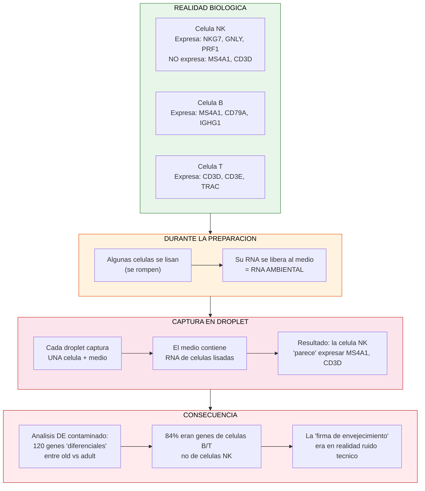
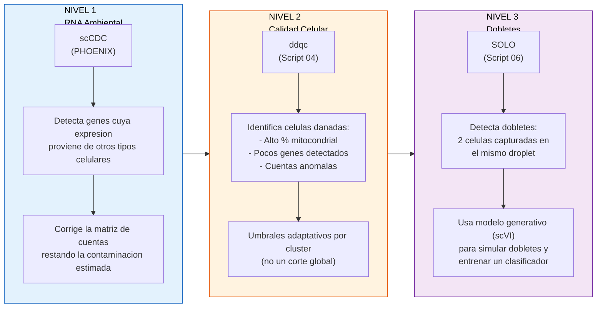
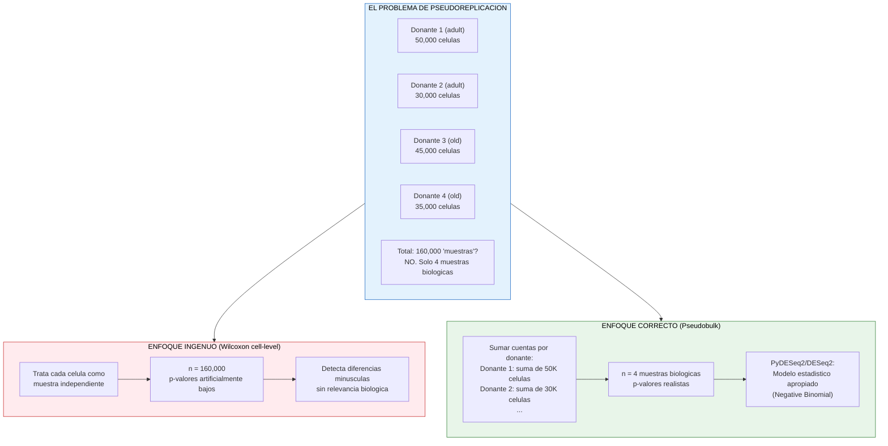

# Conceptos biologicos clave del pipeline

## El problema central: RNA ambiental en scRNA-seq

## Solucion: pipeline de purificacion en 3 niveles

## Por que pseudobulk para expresion diferencial?

## Marcadores clave y su interpretacion

### Marcadores de contaminacion (deben BAJAR despues de la limpieza)

| Gen | Tipo celular real | En celulas NK = contaminacion |
|-----|-------------------|-------------------------------|
| MS4A1 (CD20) | Celulas B | Si aparece en NK, es RNA ambiental de B |
| CD79A | Celulas B | Receptor de celulas B |
| IGHG1, IGKC | Celulas B | Inmunoglobulinas (anticuerpos) |
| MZB1 | Celulas B (zona marginal) | Chaperona de Ig |
| CD3D, CD3E, CD3G | Celulas T | Complejo CD3 (TCR) |
| TRAC | Celulas T | Cadena alfa del TCR |
| IFI30 | Monocitos/macrofagos | Procesamiento de antigenos MHC-II |
| C1QA | Monocitos/macrofagos | Complemento |
| IL1B | Monocitos | Citocina inflamatoria |
| HBB | Eritrocitos | Hemoglobina |

### Marcadores de identidad NK (deben MANTENERSE)

| Gen | Funcion en celulas NK |
|-----|----------------------|
| NKG7 | Proteina de granulos citotoxicos |
| NCAM1 (CD56) | Marcador clasico de NK |
| FCGR3A (CD16) | Receptor Fc para ADCC |
| PRF1 | Perforina (citotoxicidad) |
| GNLY | Granulisina (antimicrobiana) |
| GZMB | Granzima B (apoptosis) |
| KLRB1 | Receptor inhibitorio de NK |

## Glosario de terminos tecnicos

| Termino | Significado |
|---------|-------------|
| **h5ad** | Formato de archivo para datos de scRNA-seq (AnnData). Contiene: matriz de cuentas (.X), metadata de celulas (.obs), metadata de genes (.var) |
| **backed mode** | Leer un h5ad sin cargar toda la matriz a RAM. Solo accede a lo que necesitas |
| **HVGs** | Highly Variable Genes. Genes con mayor variabilidad entre celulas. Se usan para reducir dimensionalidad sin perder informacion biologica |
| **scVI** | Single-cell Variational Inference. Modelo generativo (VAE) que aprende una representacion latente de los datos corrigiendo batch effects |
| **SOLO** | Doublet detection using semi-supervised classification. Usa scVI para generar dobletes sinteticos y entrenar un clasificador |
| **ddqc** | Data-driven QC. QC adaptativo que define umbrales por cluster en lugar de globales |
| **MAD** | Median Absolute Deviation. Medida robusta de dispersion. Se usa para definir outliers: valor > mediana + 2.5*MAD |
| **scCDC** | Single-Cell Contamination Detection and Correction. Identifica genes cuya expresion en un tipo celular proviene de contaminacion |
| **Pseudobulk** | Agregar cuentas de todas las celulas del mismo donante para tener una "muestra" por individuo. Necesario para estadistica correcta |
| **PyDESeq2** | Implementacion en Python de DESeq2 (modelo Negative Binomial para RNA-seq) |
| **Leiden** | Algoritmo de clustering basado en grafos (mejor que Louvain para comunidades grandes) |
