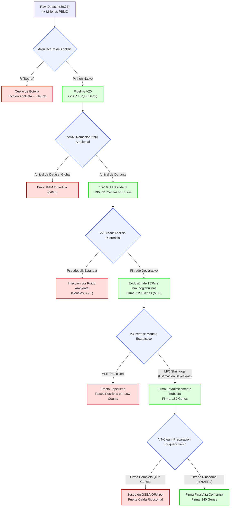

# Árbol de Decisiones Técnicas: Pipeline NK Transcriptómica y Envejecimiento

Este documento traza la evolución metodológica del pipeline de análisis transcriptómico para células Natural Killer (NK). Documenta las ramificaciones críticas, los cuellos de botella tecnológicos y las decisiones estadísticas que transformaron un dataset crudo y masivo en una firma biológica de envejecimiento de alta confianza.

## 1. Diagrama de Flujo de Decisiones (Decision Tree)

---

## 2. Cronología y Justificación Táctica

A continuación, se detallan los nodos clave de este árbol, justificando por qué la investigación fue tomando estas rutas específicas, cómo cambió la población "n" en cada paso y los motivos detrás de las decisiones técnicas.

### Fase 1: El Desafío de Escala (Era V20 Watershed)
*   **Punto de Partida**: El análisis inició con un dataset transcriptómico monstruoso de más de **4 millones de células PBMC** (Peripheral Blood Mononuclear Cells) humanas, pesando aproximadamente 80GB.
*   **La Decisión Arquitectónica**: Migrar completamente a una tubería 100% nativa en Python.
*   **Justificación**: En iteraciones previas, se intentó procesar los datos utilizando herramientas tradicionales en R (como Seurat). Sin embargo, la fricción de estar transformando la matriz de objetos `AnnData` (Python) a `Seurat` (R) y de vuelta, no solo generaba irregularidades técnicas, sino que el inmenso tamaño del dataset imposibilitaba procesarlo al completo en R, colapsando los entornos.

### Fase 2: Purificación Quirúrgica y Limitaciones de Hardware (scAR)
*   **Población Intermedia**: Fracción de células anotadas como NK.
*   **La Decisión Táctica**: Aplicar la corrección de RNA ambiental (mediante `scAR`) a **nivel de donante** en lugar de aplicarla a nivel global del dataset.
*   **Justificación**: El hardware disponible contaba con un límite estricto de 64GB de RAM (frente a un dataset original de 80GB). Intentar construir el modelo probabilístico de ruido global desbordaba la memoria. Particionarlo por donante no solo resolvió el cuello de botella computacional, sino que resultó ser biológicamente más preciso, ya que la "sopa de RNA ambiental" varía según el pozo/donante.
*   **El Resultado**: La creación del "Gold Standard V20", un subconjunto extremadamente puro de **196,091 células NK**, habiendo excluido dobletes y contaminación cruzada severa.

### Fase 3: V2-Clean (El Primer Filtrado Declarativo)
*   **Población Analizada**: 191,903 células distribuidas en **182 donantes** (muestras reales), consolidadas en seudobulk (Pseudobulk) utilizando `PyDESeq2`.
*   **La Decisión**: Excluir declarativamente genes de Inmunoglobulinas (`IGH*`, `IGK*`, `IGL*`) y de receptores de células T (`TR*`).
*   **Justificación**: A pesar del filtrado matemático previo, residuos microscópicos del RNA ambiental de células B y T altamente productivas amenazaban con ensuciar el análisis diferencial de las NKs. Este filtro preventivo erradicó esa posibilidad.
*   **El Resultado**: Una firma inicial de **229 genes significativos** (criterio: $padj < 0.05, |LFC| > 1$).

### Fase 4: V3-Perfect (Controversia y Rigor Estadístico)
*   **El Problema**: El altísimo poder estadístico conferido por tener una muestra masiva ($n=182$ donantes reales) provocó una inflación de falsos positivos en genes con muy bajas lecturas (Low Counts). Un cambio minúsculo entre 0 y 2 lecturas disparaba el Fold Change artificialmente (*Efecto Espejismo*).
*   **La Decisión**: Implementar **LFC Shrinkage** (una estimación Bayesiana equivalente a apeGLM).
*   **Justificación**: Para blindar la investigación contra recientes debates y controversias estadísticas en el campo de la transcriptómica de poblaciones grandes. El *shrinkage* "encoge" hacia cero los LFCs de genes estocásticos (escasos), respetando solo los cambios biológicos que son consistentes y tienen una expresión base sólida.
*   **El Resultado**: La "Firma Robusta", que redujo la lista descartando el ruido estadístico para quedar en **182 genes reales**. (Validando, por ejemplo, que la brutal caída de toda la maquinaria ribosomal era un fenómeno biológico fidedigno y no un artefacto estadístico).

### Fase 5: V4-Clean (Alineamiento con Tesis y Enriquecimiento)
*   **El Problema de Tesis**: Aunque real y estadísticamente irreprochable en V3, la subexpresión masiva de 45 genes ribosomales era tan fuerte que dominaba por completo la señal matemática. Si esa lista se introducía en algoritmos como GSEA u ORA, monopolizaría los resultados ocultando otros procesos vitales de la inmunosenescencia (inflammaging, metabolismo, etc.).
*   **La Decisión**: Remover administrativamente los genes con prefijos `RPS` y `RPL`.
*   **Justificación**: Decisión de dirección para orientar el descubrimiento biológico. Se estableció aislar el análisis ribosomal en su propia discusión y limpiar la lista principal para permitir el descubrimiento de nuevas vías genéticas de envejecimiento sin sesgos dominantes.
*   **El Resultado**: La **Firma Final de Alta Confianza de 140 genes**, preparada y estandarizada para la fase de Análisis de Enriquecimiento Funcional.
