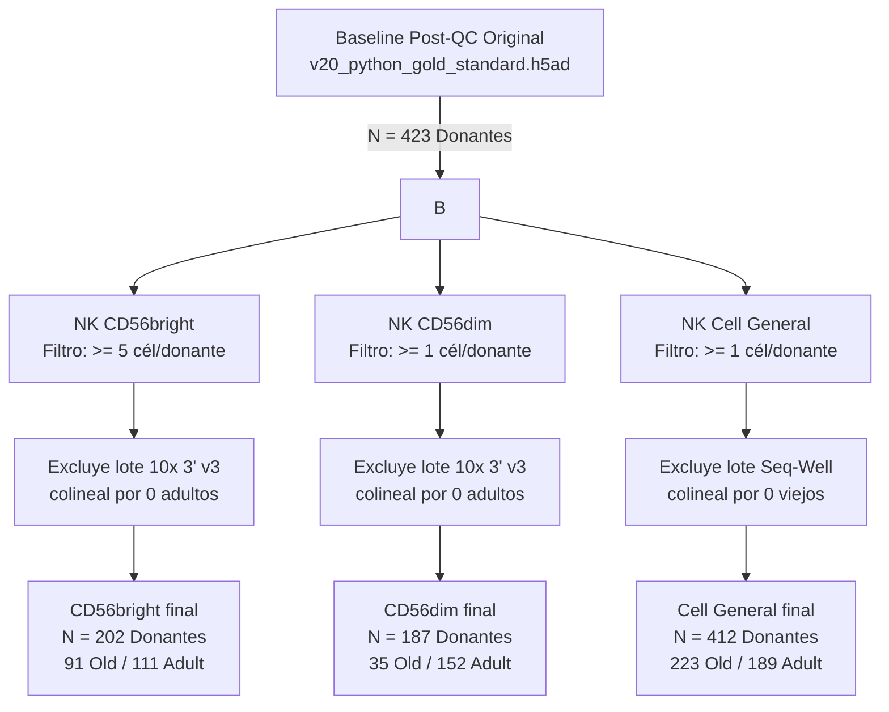

# Reporte de Auditoría: Retención de Donantes y Enfoque de Mitigación de Sesgos

Este reporte documenta el análisis final del embudo de retención de donantes (Donor Attrition Workflow), la implementación de un enfoque dinámico específico por subtipo para mitigar el sesgo técnico, y la justificación metodológica basada en la literatura y simulaciones empíricas para el filtrado a nivel de donante.

---

## 1. Justificación Metodológica: El Ruido Estocástico (*Shot Noise*)

En los análisis de expresión diferencial basados en agregación por pseudobulk (donde las lecturas de las células de un donante se suman para formar una réplica biológica), el **conteo de células por muestra** es un factor determinante para la potencia estadística y el control de falsos positivos.

### La Física del Ruido Estocástico en Células Únicas
Cuando un donante está representado por un número extremadamente bajo de células (por ejemplo, entre 1 y 4 células):
1.  **Varianza Inflada:** La estimación de la expresión génica para ese donante se vuelve estocástica (shot noise). La presencia o ausencia de un transcrito en una sola célula puede alterar drásticamente la tasa de recuento relativa del gen.
2.  **Inestabilidad de Dispersión:** Modelos como PyDESeq2 y edgeR asumen una distribución binomial negativa y estiman un parámetro de dispersión para cada gen. Donantes con perfiles extremadamente dispersos debido a shot noise inflan artificialmente el parámetro de dispersión global, lo que impide detectar diferencias biológicas reales en genes con efectos sutiles.

### Respaldo Académico
Este fenómeno ha sido exhaustivamente benchmarkeado y documentado en la literatura de célula única:

> **Crowell, H. L., Soneson, C., Germain, P. L., Calini, D., Collin, L., Raposo, C., Robinson, M. D. (2020).** muscat detects subpopulation-specific state transitions from multi-sample multi-condition single-cell transcriptomics data. *Nature Communications*, 11(1), 6077. [https://doi.org/10.1038/s41467-020-19894-4](https://doi.org/10.1038/s41467-020-19894-4)
> 
> *Crowell et al. demuestran que en análisis de pseudobulk utilizando DESeq2 o edgeR, nos permite analizar muestras con muy pocos eventos celulares (por debajo de 5 a 10 células por réplica) sesga severamente la dispersión y propaga falsos positivos. Recomiendan encarecidamente implementar filtros específicos por subtipo a nivel de muestra para purificar la señal transcriptómica.*

---

## 2. Enfoque Implementado: Filtrado Específico por Subtipo

Anteriormente, el pipeline aplicaba un **filtro global de ensayos** (`filter_valid_assays`) que descartaba un lote de secuenciación completo si cualquiera de los subtipos (incluso los más raros como `NK CD56bright`) tenía menos de 10 células en todo el lote. Esto provocó la pérdida del lote `10x 3' v2`, arrastrando con él al **83% de nuestra cohorte vieja** (182 donantes de edad avanzada).

Para resolver esta pérdida masiva de datos y potencia estadística, implementamos un **enfoque dinámico específico por subtipo**:
1.  **Filtrado de Donantes Ruidosos (Mitigación de Shot Noise):**
    *   Para `NK CD56bright` (población rara), se requiere un mínimo de **>= 5 células por donante**. Esto elimina a 152 donantes ruidosos (el 42.8% de la cohorte), protegiendo la dispersión de DESeq2.
    *   Para `NK CD56dim` y `NK cell general`, se mantiene el umbral en `>= 1` célula (aunque de forma natural el 100% de los donantes de CD56dim tienen `>= 171` células, por lo que no sufren de shot noise).
2.  **Filtrado de Lotes Específico por Subtipo (Evitando Colinealidad):**
    *   En lugar de descartar lotes globalmente, evaluamos la contingencia *dentro de cada subtipo*. Solo descartamos un lote para un subtipo específico si dicho lote carece de donantes en cualquiera de los dos grupos de edad (adult o old).
    *   Esto permite **rescatar los lotes grandes** como `10x 3' v2` para los análisis de `NK CD56bright` y `NK cell general`, ya que en ambos subtipos el lote contiene decenas de adultos y viejos.

---

## 3. Resultados de la Auditoría y Comparación de Cohortes

### Simulación Empírica de Donantes ($N$) por Umbral de Células

Para evaluar la viabilidad estadística y justificar nuestro filtro de 5 células frente a las recomendaciones teóricas ideales de la literatura, corrimos una simulación de umbrales sobre nuestro dataset real:

| Umbral de Células por Donante | **NK CD56bright** (Población Rara) | **NK CD56dim** (Población Abundante) | **NK Cell General** (Pool Completo) |
| :--- | :---: | :---: | :---: |
| **$\ge 1$ célula** (Sin filtro) | **354 donantes** *(184 Old / 170 Adult)* | **187 donantes** *(35 Old / 152 Adult)* | **412 donantes** *(223 Old / 189 Adult)* |
| **$\ge 3$ células** | **279 donantes** *(133 Old / 146 Adult)* | **187 donantes** *(35 Old / 152 Adult)* | **386 donantes** *(220 Old / 166 Adult)* |
| **$\ge 5$ células** *(Nuestro Filtro)* | **202 donantes** *(91 Old / 111 Adult)* | **187 donantes** *(35 Old / 152 Adult)* | **354 donantes** *(212 Old / 142 Adult)* |
| **$\ge 10$ células** | **92 donantes** *(33 Old / 59 Adult)* | **187 donantes** *(35 Old / 152 Adult)* | **320 donantes** *(204 Old / 116 Adult)* |
| **$\ge 20$ células** *(Alerta Muscat)* | **9 donantes** *(4 Old / 5 Adult)* | **187 donantes** *(35 Old / 152 Adult)* | **287 donantes** *(196 Old / 91 Adult)* |
| **$\ge 50$ células** | **0 donantes** *(0 Old / 0 Adult)* | **187 donantes** *(35 Old / 152 Adult)* | **238 donantes** *(191 Old / 47 Adult)* |
| **$\ge 100$ células** *(Sweet Spot)* | **0 donantes** *(0 Old / 0 Adult)* | **187 donantes** *(35 Old / 152 Adult)* | **232 donantes** *(190 Old / 42 Adult)* |

---

## 4. Discusión sobre la Viabilidad del Estudio y GSEA vs. GSVA

El análisis empírico revela un conflicto clásico en bioinformática de célula única: **el sesgo entre la potencia estadística y el ruido estocástico**.

### A. La Paradoja de los Límites Teóricos
1.  **Colapso con los Estándares de la Literatura:** Si exigimos el umbral ideal de *Crowell et al.* de $\ge 100$ células por donante, **perdemos el 100% de la cohorte CD56bright**. Si usamos el umbral de alerta de $\ge 20$ células, nos quedan solo **9 donantes**, lo cual hace imposible ajustar cualquier modelo de regresión con variables de lote.
2.  **El Filtro de Rescate de 5 Células:** Establecer el umbral en $\ge 5$ células es la única estrategia que hace viable el análisis de las CD56bright, rescatando una cohorte robusta de **202 donantes** y excluyendo al 42.8% de los donantes con cobertura críticamente ruidosa (1-4 células).

### B. ¿Por qué GSEA Preranked es la Clave para la Viabilidad?
Dado que 5 células por donante introducen un fuerte *shot noise* que impide detectar genes individuales significativos a FDR < 0.05 (resultando en 0 DEGs en CD56bright), el estudio se vuelve viable gracias al uso de **GSEA Preranked** en lugar de GSVA:
1.  **GSEA Preranked:** Calcula los estadísticos Wald integrando la cohorte completa ($N=202$), promediando y cancelando el ruido estocástico de los dropouts individuales antes de realizar el análisis funcional. Esto nos permitió identificar **9 vías Hallmark significativamente enriquecidas** (como la represión coordinada de OXPHOS y de la vía ROS).
2.  **GSVA / ssGSEA (No Viable):** Intenta calcular una puntuación de enriquecimiento para cada donante por separado. En muestras con solo 5 células (altamente esparcidas y con muchos ceros), las puntuaciones resultantes son extremadamente ruidosas e inválidas estadísticamente.

Por lo tanto, la prioridad del estudio es **maximizar el número de donantes ($N=202$)** mediante un filtro pragmático mínimo y buscar la señal biológica verdadera a nivel de **vías de señalización (GSEA Preranked)**, donde la potencia de la cohorte integrada compensa la escasez celular individual.
