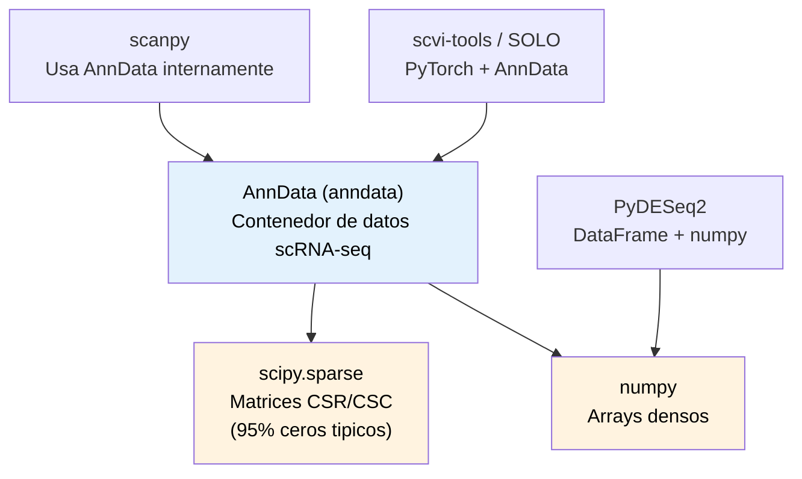
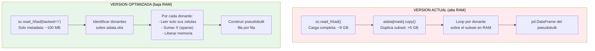

# Analisis de uso de memoria y estrategias de optimizacion

## Librerias usadas para calculo de matrices



## Mapa de consumo de memoria por script

| Script | Picos de memoria | Causa |
|--------|------------------|-------|
| **06-doublet-removal** | **MAXIMO** (3-4x dataset) | 3 copias simultaneas: `adata`, `adata_raw`, `adata_hvg` |
| **10-pseudobulk** | ALTO (~2x dataset) | `cell_subset = adata[mask].copy()` materializa subset completo |
| **04-adaptive-qc** | ALTO | ddqc convierte a MultimodalData (otra copia) + clustering global |
| **09-comparative-de** | MEDIO | Wilcoxon necesita normalizacion en RAM |
| **07-evaluate-ambient** | BAJO | Ya itera segmentos (modelo a seguir) |
| **08-explore-legacy** | BAJO | Usa `backed='r'`, solo lee 10K celulas |

## Operaciones costosas comunes

```python
# COSTOSO: materializa la matriz completa en RAM
adata = sc.read_h5ad(path)              # ~6-8 GB para 196K x 33K sparse
adata_copy = adata.copy()                # +6-8 GB
subset = adata[mask].copy()              # +(fraccion del original)

# COSTOSO: densifica la matriz sparse
X_dense = adata.X.toarray()              # 196K x 33K float32 = ~25 GB!

# BARATO: lectura backed (solo metadata)
adata = sc.read_h5ad(path, backed='r')   # ~100 MB (solo .obs y .var)
```

## Estrategias de optimizacion (ordenadas por impacto)

### 1. Lectura backed + iteracion por donante (script 10, 06)
- **Ahorra**: ~80% de RAM
- **Costo**: 2-3x mas tiempo de I/O
- **Aplicable a**: pseudobulk, HVG selection, cualquier reduccion por grupo

### 2. Eliminar copias innecesarias (script 06)
- **Ahorra**: ~40% de RAM
- **Costo**: ninguno
- **Cambios**: usar slicing sin `.copy()` cuando sea posible, liberar memoria con `del adata_hvg; gc.collect()`

### 3. Procesamiento paralelo por chunks (script 10)
- **Ahorra**: depende del numero de workers
- **Costo**: requiere mas cores pero menos RAM por proceso
- **Aplicable a**: operaciones independientes por grupo (pseudobulk por donante)

### 4. Mantener sparse hasta el final
- **Ahorra**: ~10-20x para matrices con 95% de ceros
- **Costo**: algunas operaciones son mas lentas en sparse
- **Cambio**: evitar `.toarray()` excepto cuando sea estrictamente necesario

## Diagrama: estrategia para script 10 (pseudobulk)


