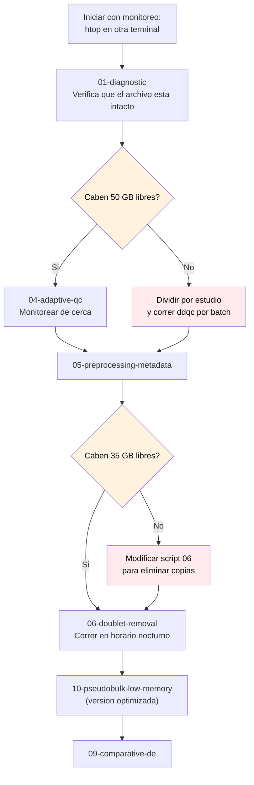

# Sizing guide: 64 GB RAM + archivo h5ad ~80 GB (~150K celulas)

## Tu hardware vs el dataset

| Recurso | Cantidad | Comentario |
|---------|----------|------------|
| RAM | 64 GB | Limite duro |
| Archivo h5ad | ~80 GB en disco | Lectura backed lo maneja |
| Celulas | ~150,000 | Pequeno-mediano para scRNA-seq |
| Genes (estimado) | ~33,000 | Tipico para humano post-filtrado |

**Insight clave:** los 80 GB del archivo NO se traducen a 80 GB en RAM.
Una matriz sparse CSR de 150K x 33K con 5% no-cero ocupa ~2 GB en RAM.
Los 80 GB del disco incluyen `.raw`, `.layers`, embeddings UMAP/PCA, grafos, etc.

## Modo de ejecucion por script (recomendaciones para 64 GB)

| Script | Modo | RAM esperada | Tiempo |
|--------|------|--------------|--------|
| 01-diagnostic | Estandar | ~3-5 GB | 1-2 min |
| 04-adaptive-qc | **Estandar con monitoreo** | ~30-50 GB | 30-60 min |
| 05-preprocessing | Estandar | ~3-5 GB | 5 min |
| 06-doublet-removal | **Modificado** (eliminar copias) | ~25-40 GB | 1-3 hrs (CPU) |
| 07-evaluate-ambient | Estandar (ya optimizado) | ~5-10 GB | 10 min |
| 08-explore-legacy | Estandar (usa backed) | ~2 GB | 2 min |
| 09-comparative-de | Estandar | ~10-15 GB | 5-10 min |
| **10-pseudobulk** | **`10-pseudobulk-low-memory.py`** | **~3-5 GB** | 15-30 min |

## Scripts SEGUROS sin modificar (caben en 64 GB)

- `01-diagnostic-report.py` - solo lee y reporta
- `05-preprocessing-metadata.py` - solo metadata
- `07-evaluate-ambient-rna.py` - ya itera segmentos
- `08-explore-legacy.py` - usa `backed='r'`

## Scripts que REQUIEREN cuidado en 64 GB

### Script 04: ddqc adaptive QC

**Problema:**
- ddqc convierte AnnData a MultimodalData de pegasus (otra copia)
- Ejecuta clustering Leiden global (necesita matriz completa en RAM)

**Estimacion:**
- AnnData original: ~5 GB
- MultimodalData copia: ~5 GB
- Matriz normalizada para clustering: ~10-15 GB
- PCA + grafo de vecinos: ~3-5 GB
- **Total pico: ~30-50 GB**

**Recomendacion:**
- Correr SOLO en este servidor cuando no haya otros procesos pesados
- Monitorear con `htop` o `psutil`
- Si falla: dividir el dataset por estudio y correr ddqc por estudio (el clustering tiene mas sentido por batch)

### Script 06: doublet removal con SOLO

**Problema:**
- 3 copias simultaneas del dataset (`adata`, `adata_raw`, `adata_hvg`)
- scVI entrenando en CPU (sin GPU) consume mas RAM

**Estimacion sin modificar:**
- 3x el dataset = ~15-25 GB solo en copias de AnnData
- scVI con 7000 HVGs en CPU: ~10-15 GB para gradientes + activaciones
- **Total pico: ~30-40 GB** (riesgoso)

**Modificacion sugerida:** eliminar `adata_hvg = adata.copy()`. Calcular HVGs sobre una copia temporal limitada al subconjunto de columnas necesarias.

### Script 10: pseudobulk

**Problema:** materializa `cell_subset = adata[mask].copy()` (subset filtrado)

**Solucion:** usar `optimizations/10-pseudobulk-low-memory.py`
- Lee en modo `backed='r'`
- Itera donante por donante (~5-15K celulas cada uno)
- RAM pico: ~3-5 GB
- Tiempo: 2-3x mas lento (15-30 min vs 5-10 min)

## Plan de ejecucion recomendado



## Tips de ejecucion en mini-server

### 1. Monitorear RAM en tiempo real
```bash
# Terminal aparte, mientras corre el script
htop                          # vista interactiva
watch -n 2 'free -h'          # actualiza cada 2s
```

### 2. Usar swap como red de seguridad (NO como solucion)
```bash
# Verificar si tienes swap activo
swapon --show

# Si no tienes, crear 16 GB de swap (solo emergencia)
sudo fallocate -l 16G /swapfile
sudo chmod 600 /swapfile
sudo mkswap /swapfile
sudo swapon /swapfile
```
**Importante:** swap es 100x mas lento que RAM. Solo te salva de OOM kill, no acelera. Si tu pipeline esta en swap, mejor reduce el tamano del problema.

### 3. Limitar threads de numpy/scipy
```bash
# Antes de correr el script
export OMP_NUM_THREADS=4
export MKL_NUM_THREADS=4
export OPENBLAS_NUM_THREADS=4
```
Por defecto numpy usa todos los cores; con muchos threads consume mas RAM en buffers temporales.

### 4. Correr en background y revisar log
```bash
# screen para sesion persistente (puedes desconectar SSH)
screen -S pseudobulk
python optimizations/10-pseudobulk-low-memory.py 2>&1 | tee pseudobulk.log
# Ctrl+A D para desconectar
# screen -r pseudobulk para reconectar
```

### 5. Agregar `gc.collect()` antes de operaciones pesadas
Si modificas otro script, agrega:
```python
import gc
del adata_temp        # libera referencia
gc.collect()           # fuerza recoleccion
```

## Como saber si vas bien

Durante la ejecucion del script optimizado deberias ver logs como:

```
[RAM] 0.50 GB | inicio
[RAM] 0.52 GB | antes de iterar donantes
[  1/ 32] old-D001234                             |   8543 celulas |   2.3s
[ 10/ 32] adult-D023456                           |   5102 celulas |   1.8s
[RAM] 1.85 GB | tras donante 10
[ 20/ 32] old-D034567                             |  12305 celulas |   3.1s
[RAM] 2.10 GB | tras donante 20
...
[RAM] 2.45 GB | pseudobulk construido
[RAM] 2.48 GB | antes de PyDESeq2
[RAM] 3.01 GB | tras PyDESeq2

Tiempo total: 18.3 min
Pico de RAM observado: 3.01 GB
```

Si ves la RAM crecer sin parar (ej: 5 GB, 10 GB, 20 GB) hay una fuga.
Detener con Ctrl+C y revisar los `del` y `gc.collect()`.
