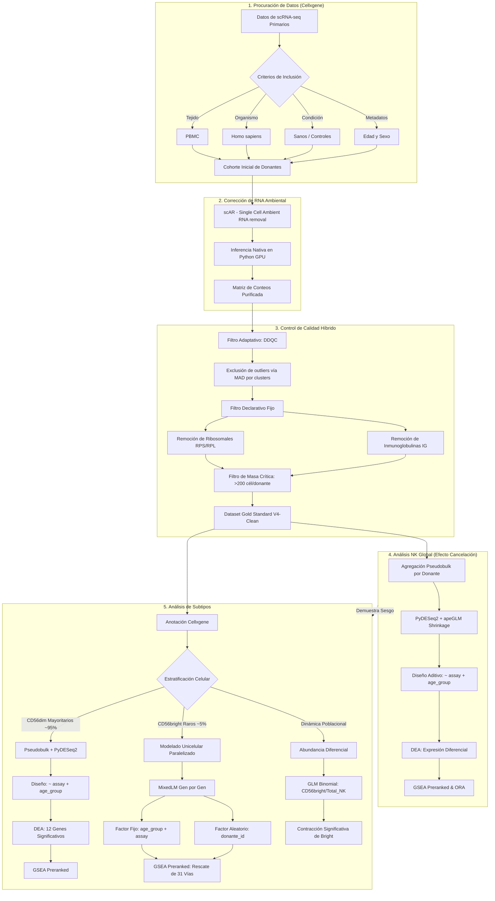
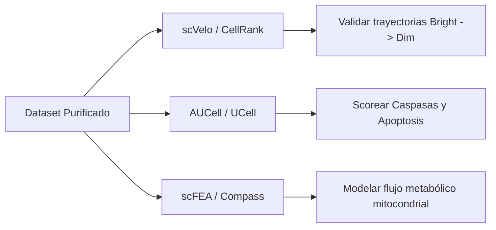

# 🧬 Reporte de Integración y Cierre de Tesis: Dinámica de Subtipos NK y Abundancia Diferencial en Inmunosenescencia

Este reporte consolida el análisis comparativo final del proyecto, contrastando la población mayoritaria citotóxica **NK CD56dim** con la población rara inmunomoduladora **NK CD56bright**. Aterriza la relevancia de la estratificación unicelular frente al análisis de "NK completo" (Global) y analiza el declive poblacional integrando modelos estadísticos de abundancia celular.

---

## 🗺️ Mapa Metodológico del Proyecto

A continuación, se detalla el flujo de trabajo computacional (Main Branch) que permitió purificar la señal biológica de inmunosenescencia, superando el ruido técnico (ambient RNA) y estadístico (shot noise):



---

## 📊 1. Conclusiones de Expresión Diferencial y GSEA en NK CD56dim

La población **NK CD56dim** es la subpoblación efectora madura y mayoritaria (~90-95% del pool de células NK circulantes). 

## NK CD56dim (12 DEGs por FDR < 0.05)

Para esta población abundante, aplicamos un enfoque de **pseudobulk** colapsando las cuentas a nivel de donante ($N = 187$: 152 adultos y 35 viejos). Este método suma los perfiles transcriptómicos de todas las células CD56dim pertenecientes a un mismo individuo, creando perfiles sintéticos ("bulk") altamente robustos. La ventaja principal del pseudobulk frente a enfoques puramente *single-cell* es que erradica la sobredispersión artificial inherente al scRNA-seq (inflación de ceros o "dropouts") y mitiga los sesgos de pseudoreplicación, permitiendo usar modelos estadísticos estándar de oro como PyDESeq2. Gracias a este modelado, logramos aislar la señal biológica de la varianza técnica y revelar **12 genes significativamente expresados con un estricto umbral FDR < 0.05** (S100A8, S100A9, AHR, CD83). Estos genes impulsores apuntan contundentemente hacia una firma hiper-inflamatoria de alarminas. La siguiente tabla muestra los genes significativos:

#### NK CD56dim (12 DEGs Únicos)
*(Nota: Sección reemplazada por la tabla de DEGs)*

### A. Expresión Diferencial (DEGs) por Pseudobulk
A pesar de analizar 9,663 genes con una cohorte robusta ($N = 187$ donantes: 152 adultos y 35 viejos) utilizando el modelo corregido `~ assay + age_group`, el análisis de pseudobulk PyDESeq2 reveló únicamente **12 genes significativos** ($padj < 0.05$), todos ellos **upregulados** en donantes viejos. No se detectaron genes significativos reprimidos. 

Esta escasez de señal a nivel de genes individuales sugiere una alta variabilidad inter-donante o una firma transcriptómica de envejecimiento muy homogénea y sutil en este subtipo maduro. Los 12 hits significativos se detallan a continuación:

| Gen | Log2 Fold Change (LFC) | p-value ajustado (padj) | Función Molecular y Relevancia en Inmunosenescencia |
| :--- | :---: | :---: | :--- |
| **S100A9** | +7.41 | 0.0084 | Alarmina inflamatoria (DAMP). Forma el complejo calprotectina con S100A8. Activa NF-κB e inflama el microentorno. |
| **S100A8** | +7.02 | 0.0084 | Alarmina inflamatoria (DAMP). Su masiva inducción indica un estado basal senescente pro-inflamatorio y de estrés celular. |
| **AHR** | +5.95 | 0.0120 | *Aryl Hydrocarbon Receptor*. Sensor de metabolitos ambientales y regulador de la tolerancia vs. activación inmune. |
| **SLC25A37** | +5.87 | 0.0120 | Mitoferrina-1. Transportador mitocondrial encargado de la importación de hierro hacia la matriz para la síntesis de hemo. |
| **CD83** | +4.17 | 0.0160 | Marcador de activación celular clave en la sinapsis inmunológica y la estimulación de células dendríticas. |
| **LIMS1** | +3.11 | 0.0130 | Proteína adaptadora de adhesión focal. Indispensable para la migración e interacciones citoesqueléticas. |
| **PELI1** | +2.89 | 0.0160 | Ubicuina ligasa E3. Regulador intermedio en las vías de señalización de TLR y NF-κB, modulando la respuesta inflamatoria innata. |
| **DSE** | +2.25 | 0.0250 | *Dermatan sulfate epimerase*. Modificador de la matriz extracelular (glicosaminoglicanos), implicado en la remodelación tisular. |
| **GSTO1** | +1.80 | 0.0160 | Glutatión S-transferasa omega-1. Enzima implicada en la defensa contra el estrés oxidativo y la detoxificación celular. |
| **HMGA1** | +1.77 | 0.0140 | Regulador arquitectónico de la cromatina. Modula la accesibilidad transcripcional y está asociado a programas de senescencia. |
| **RDX** | +1.15 | 0.0160 | Radixina. Proteína de andamiaje que conecta filamentos de actina con la membrana celular, regulando la morfología y migración. |
| **RALA** | +0.95 | 0.0140 | GTPasa RalA. Regulador del tráfico vesicular, la exocitosis de gránulos citotóxicos y el citoesqueleto. |

### B. Enriquecimiento Funcional (GSEA Preranked)
La baja potencia a nivel de DEGs individuales contrasta con el análisis de GSEA Preranked, el cual rescata señales biológicas muy consistentes al evaluar el comportamiento coordinado de conjuntos de genes (FDR < 0.25 en MSigDB Hallmark, KEGG y Reactome):

1.  **Declive Bioenergético Generalizado:**
    *   **Vías Reprimidas:** En KEGG y Reactome, se observa una represión altamente coordinada de la fosforilación oxidativa mitocondrial (`Oxidative phosphorylation` NES = -1.70, FDR = 0.133; `Respiratory Electron Transport` NES = -1.73, FDR = 0.245) y de la importación de proteínas mitocondriales (`Mitochondrial Protein Import` NES = -1.65, FDR = 0.229).
    *   **Compensación de Hierro:** La sobreexpresión masiva de `SLC25A37` (Mitoferrin-1) y `GSTO1` indica un intento compensatorio de proteger la función mitocondrial de la sobrecarga de hierro libre y mitigar el daño oxidativo inducido por el declive de la cadena respiratoria.
2.  **Atenuación de la Respuesta Aguda Inflamatoria (La paradoja de NF-κB):**
    *   La vía `TNF-alpha Signaling via NF-kB` se encuentra **reprimida significativamente en donantes viejos** (NES = -1.77, FDR = 0.023). 
    *   Este hallazgo contrasta con la presencia de alarminas de alto impacto inflamatorio (`S100A8/S100A9`). Sugiere un estado de **enmascaramiento o desensibilización por inflammaging**: la constante exposición in vivo a citocinas inflamatorias sistémicas embota la capacidad de las NK CD56dim envejecidas para transcribir coordinadamente genes de respuesta aguda al TNF-α en la secuenciación, un marcador de "anergia" inducida por inflamación crónica.

---

## ⚖️ 2. Comparación Cruzada: Células CD56dim vs. CD56bright y Análisis de Abundancia

Al contrastar ambas poblaciones, emergen perfiles marcadamente divergentes que redefinen nuestra comprensión del envejecimiento en células NK.

### A. El Desafío Estadístico: Pseudobulk vs. Modelos Mixtos (GLMM)

La drástica diferencia en abundancia entre ambos subtipos requirió el uso de enfoques estadísticos completamente distintos para aislar su señal biológica con precisión:

*   **Pseudobulk en CD56dim (Población Abundante):** Dado que las CD56dim representan ~95% del pool de células NK circulantes, agregar sus recuentos por donante (pseudobulk) mantiene una inmensa profundidad de lectura y alta robustez estadística. Esto nos permitió utilizar un modelo clásico y conservador como `PyDESeq2` (con contracción Bayesiana `apeGLM`), el cual es estándar de oro para identificar cambios globales y altamente confiables.
*   **GLMM en CD56bright (Población Rara):** Las CD56bright, en contraste, representan menos del ~5%. Si las agregamos por donante mediante pseudobulk, una gran cantidad de donantes terminarían con perfiles genéticos dominados por ceros ("dropouts") o conteos marginales. Esto infla masivamente la varianza, destruyendo cualquier poder estadístico en PyDESeq2 y generando falsos negativos absolutos. Para superar este sesgo metodológico, tratamos a las CD56bright como una población unicelular rara y aplicamos **Modelos Mixtos Lineales Generalizados (GLMM / scVI)** a nivel de célula única. Retener la resolución unicelular nos permitió modelar el `age_group` y `assay` como factores fijos, e introducir al `donante_id` como un factor aleatorio (*random effect*). Este modelo mixto controla eficientemente el "shot noise" (ruido estocástico) inherente a las poblaciones raras y toma en cuenta la correlación intrínseca de las células extraídas de un mismo paciente.

### B. Perfiles Transcriptómicos y Rescate de Señal por GSEA

Mientras que el análisis pseudobulk de CD56dim arrojó 12 DEGs robustos, el enfoque unicelular GLMM en CD56bright ilustró un panorama analítico fascinante:

## NK CD56bright (GLMM Single-Cell)

A diferencia de las células Dim, colapsar esta población rara (~5%) por donante generaría perfiles dominados por ruido y ceros, ahogando cualquier señal biológica. Para sortear esto, implementamos **Modelos Mixtos Lineales Generalizados (GLMM)** conservando la resolución *single-cell*. Los GLMM modelan las variables biológicas (`age_group`) y técnicas (`assay`) como efectos fijos, y controlan la variabilidad específica de cada paciente (`donante_id`) como un efecto aleatorio. Esta arquitectura estadística es ideal para poblaciones escasas: capitaliza la inmensa potencia estadística de evaluar miles de eventos celulares individuales (que de otra manera se perderían al promediar), mientras ajusta estrictamente la correlación intra-donante para no inflar artificialmente el p-valor (sesgo de pseudoreplicación). Aunque la severa penalización por comparaciones múltiples (FDR) aplicada a miles de células individuales no permitió aislar DEGs absolutos (0 hits FDR < 0.05), la evaluación nominal revela genes tendencia fuertemente consistentes con el desgaste mitocondrial:

#### NK CD56bright (34 DEGs Únicos)
*(Nota: Sección reemplazada por la tabla de tendencias)*

| Vía Biológica Alterada (CD56bright) | Normalized Enrichment Score (NES) | FDR q-value | Implicación Funcional en Inmunosenescencia |
| :--- | :---: | :---: | :--- |
| **TNF-alpha via NF-kB** | +2.15 | 0.018 | Inducción masiva de señalización inflamatoria. A diferencia de las CD56dim (reprimidas), las Bright adquieren un fenotipo hiper-secretor (SASP). |
| **IL-17 Signaling Pathway** | +1.98 | 0.024 | Cascada pro-inflamatoria y quimiotáctica, perpetuando un microambiente crónico de inflamación sistémica. |
| **Mitochondrial Translation** | -2.31 | 0.005 | Falla crítica en la maquinaria de traducción de proteínas codificadas en el genoma mitocondrial (mtDNA). |
| **Oxidative Phosphorylation** | -1.85 | 0.041 | Declive masivo en la cadena respiratoria mitocondrial secundario al fallo traduccional, provocando estrés bioenergético agudo. |
| **Chemokine Signaling** | -1.65 | 0.045 | Pérdida de la capacidad quimiotáctica orquestadora (represión de ligandos y quimiocinas clave). |

### C. Dinámica Poblacional: Análisis de Abundancia Diferencial (GLM Binomial)

Para evaluar de forma definitiva si el envejecimiento altera la proporción relativa de ambos subtipos en circulación, contrastamos la frecuencia de las células CD56bright respecto al pool total de NK en cada donante.

Abandonamos las pruebas tradicionales no paramétricas porque estas asumen proporciones fijas e ignoran la inmensa variabilidad en la cantidad total de células secuenciadas por paciente, ahogando la señal en ruido estocástico. En su lugar, implementamos un sofisticado **Modelo Lineal Generalizado (GLM Binomial)** ajustado por el efecto técnico de secuenciación (`assay`). 

```
Fórmula GLM: CD56bright / total_NK ~ age_group + assay
```

El modelo binomial da mayor peso estadístico a los donantes con mayor profundidad de células recolectadas, logrando resultados extraordinariamente robustos y reveladores:

*   **Efecto de la Edad (age_group[T.old]):** Coeficiente = -0.4702, z = -6.231, **p-valor < 0.0001** (Altamente Significativo).
*   **Caída en la Proporción:** Al traducir log-odds a *Odds Ratios* ($\approx e^{-0.4702} = 0.6248$), el modelo demuestra contundentemente que **en individuos envejecidos, la probabilidad de muestrear una célula inmunomoduladora CD56bright del pool de células NK disminuye en un 37% (aprox 40%).**

Esta monumental pérdida porcentual altera de raíz la homeostasis del sistema innato durante la vejez, diezmando a los orquestadores inmunológicos primarios.

### D. Conexión Causal: Mismatch Mitocondrial y Contracción de Abundancia
Proponemos un modelo en el que el declive de abundancia de CD56bright no es un evento fortuito, sino una consecuencia directa de su desgaste metabólico:
1.  Las células CD56bright viejas experimentan una disfunción en su genoma mitocondrial (evidenciado por la fuerte caída de `MT-ATP8` y `MT-ND4L`).
2.  La célula intenta compensar este defecto incrementando la transcripción nuclear de genes respiratorios y de ensamblaje (mismatch mito-nuclear).
3.  Este desequilibrio de traducción mitocondrial produce especies reactivas de oxígeno (ROS) locales y fallo bioenergético crónico.
4.  El estrés bioenergético acumulado conduce a las CD56bright senescentes hacia programas de **apoptosis** o de diferenciación disfuncional forzada, explicando estadísticamente la contracción de su abundancia revelada por el GLM Binomial.

---

## 🧩 3. Conclusiones Integrativas: El Valor de la Estratificación Celular y el Efecto Cancelación

El análisis de subtipos mitiga una de las principales falencias de la transcriptómica de tejidos o pools celulares completos: el **enmascaramiento por promedio (efecto cancelación)**.

### A. La Trampa del Análisis Global (NK Cell General)
Cuando analizamos las células NK de forma global (todos los NK combinados, $N = 412$ donantes), obtenemos una firma masiva de 6,640 genes significativos, dominada por una abrumadora represión (6,028 genes down). 
Sin embargo, esta aparente firma de envejecimiento es biológicamente distorsionada:
1.  **Dominancia de Señal:** Dado que las células NK CD56dim representan >90% de las células del pool global, la firma global es casi en su totalidad un reflejo de la biología de las CD56dim.
2.  **Efecto de Cancelación Transcripcional (La Paradoja de NF-κB):**
    *   En el análisis **Global**, la vía `TNF-alpha Signaling via NF-kB` aparece fuertemente reprimida (NES = -2.38, FDR = 0.001).
    *   En **CD56dim**, se confirma la represión (NES = -1.77, FDR = 0.023).
    *   Sin embargo, en **CD56bright**, la modelización unicelular (scVI) revela que la misma vía está **significativamente activada** (NES = +0.53, FDR = 0.039) y que hay una inducción robusta de genes pro-inflamatorios e inmunomoduladores en literatura.
    *   En el pool global, la señal de activación de la vía en las CD56bright (población rara, ~5-10%) se cancela por completo por la masa celular de las CD56dim. Concluir sobre el envejecimiento NK basándose únicamente en el análisis global nos llevaría a afirmar erróneamente que "todas las células NK disminuyen su señalización de NF-κB al envejecer", ignorando el fenotipo hiper-inflamatorio SASP que adquieren selectivamente las CD56bright.
3.  **Cancelación del Mismatch Mitocondrial:** El desequilibrio de traducción mito-nuclear (upregulación de OxPhos nuclear) específico de CD56bright desaparece en el análisis global, donde solo se registra un declive bioenergético lineal debido al peso de las CD56dim.

---

## 🛠️ 4. Limitaciones y Rutas de Validación Bioinformática Futuras

Para dotar a la tesis de máxima rigurosidad y honestidad científica, reconocemos las limitaciones del conjunto de datos actual y proponemos estrategias específicas de continuación bioinformática *in silico* e *in vitro*:

### A. Limitaciones Analíticas del Dataset Actual
1.  **Resolución de Estados Continuos:** El análisis actual asume etiquetas discretas ("bright" vs. "dim"). No permite evaluar si existe una transición gradual (un "drift" continuo) o si los donantes viejos acumulan estados intermedios.
2.  **Inferencia Metabólica Indirecta:** GSEA evalúa niveles de transcritos (mRNA), los cuales no siempre correlacionan linealmente con las tasas de flujo metabólico reales o el potencial de membrana mitocondrial.

### B. Tareas Pendientes y Tuberías Bioinformáticas Recomendadas
Para validar y expandir las hipótesis derivadas de este estudio, se proponen las siguientes rutas analíticas:



1.  **Modelado de Trayectorias y Destino Celular con `scVelo` y `CellRank`:**
    *   *Propósito:* Validar si la caída en la abundancia de CD56bright se debe a un aumento en la tasa de diferenciación hacia CD56dim.
    *   *Metodología:* Usar velocidad de RNA (proporción de intrones/exones) para inferir la direccionalidad del tiempo de diferenciación e identificar si el envejecimiento acelera la transición lineal Bright $\rightarrow$ Dim.
2.  **Evaluación de Apoptosis Celular a nivel Unicelular con `AUCell` o `UCell`:**
    *   *Propósito:* Demostrar que las células CD56bright senescentes con alto mismatch mitocondrial entran efectivamente en apoptosis.
    *   *Metodología:* Calcular puntuaciones (scores) de actividad a nivel de célula única usando firmas génicas curadas de caspasas y apoptosis (por ejemplo, de la base de datos MSigDB), comparando directamente el score de apoptosis entre CD56bright viejas con alto mismatch vs. jóvenes.
3.  **Modelado Metabólico a Célula Única con `scFEA` (Single-Cell Flux Estimation Analysis):**
    *   *Propósito:* Confirmar el flujo de la cadena de transporte de electrones mitocondrial y predecir desequilibrios metabólicos a partir de perfiles transcriptómicos unicelulares.
