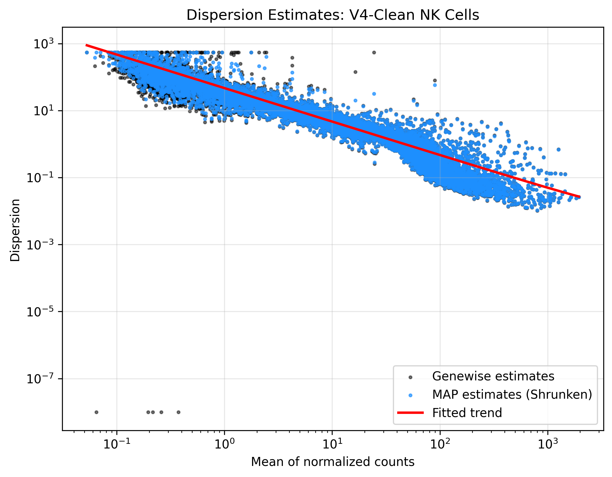
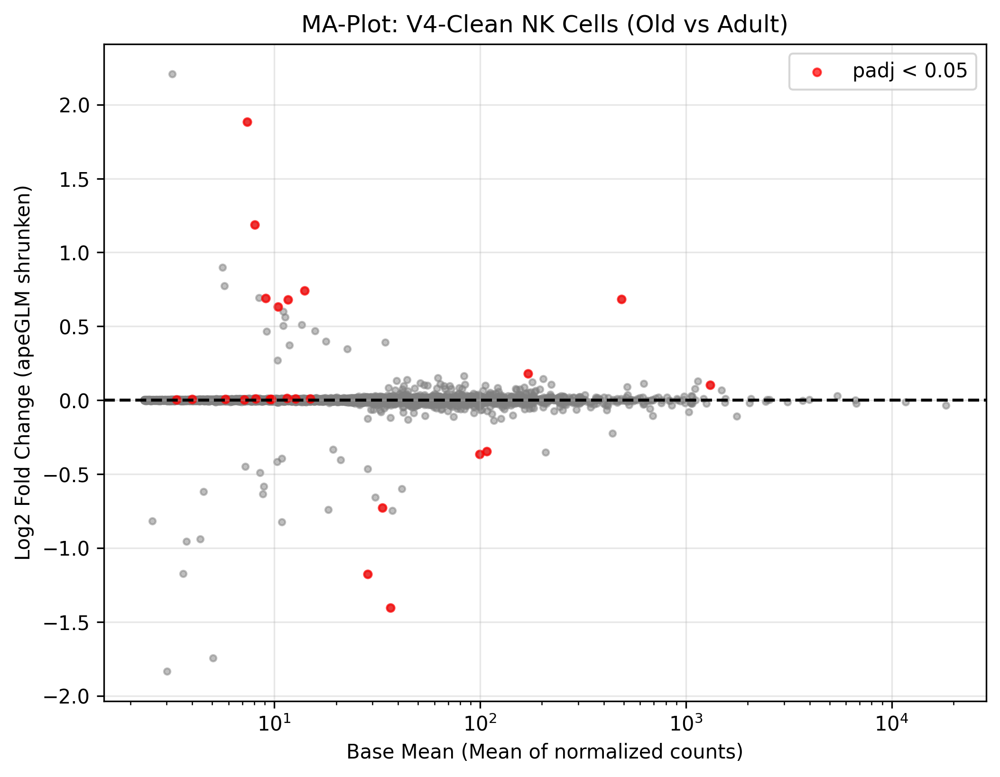
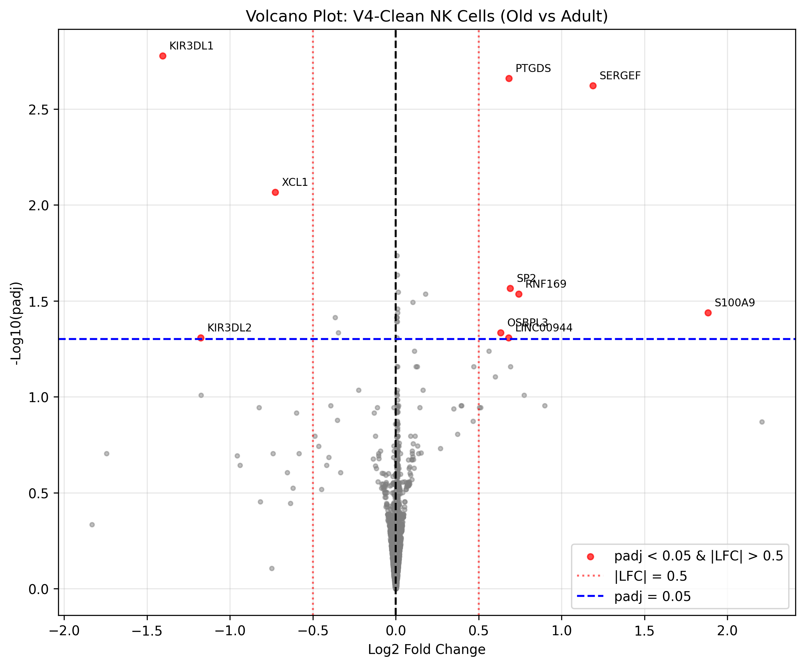
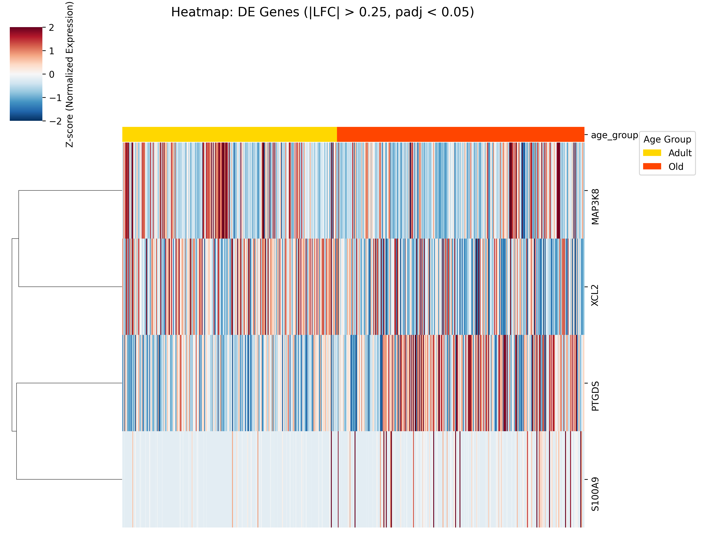

# 📄 Reporte Integral: Análisis de Expresión Diferencial y Control de Calidad (V4-Clean - Corregido)

Este documento presenta la validación metodológica y los resultados definitivos del análisis transcriptómico de células NK. El objetivo principal ha sido aislar la auténtica firma biológica del envejecimiento (inmunosenescencia) neutralizando el ruido técnico estructural del dataset.

---

## 1. Fundamentos Metodológicos y Decisiones Técnicas

Tras una exhaustiva auditoría de varianza, se determinó que el 69% de la variación en los datos iniciales provenía de factores técnicos (lote de secuenciación/assay) y no de factores biológicos. Para corregir esto, se implementó el siguiente marco metodológico basado en las directrices de `DESeq2`:

1.  **Unidad Experimental (Pseudobulk):** Se agregaron los conteos crudos a nivel de donante único (N = 423). Esto previene que donantes con miles de células dominen estadísticamente sobre donantes con escasa representación.
2.  **Modelo Estadístico de Rango Completo:** Se utilizó la fórmula de diseño aditivo `~ assay + age_group`. Esto permite al algoritmo estimar y sustraer el efecto de lote (`assay`) antes de calcular el impacto biológico de la edad (`age_group`).
3.  **Filtrado Estricto:** Se eliminaron transcritos de baja señal (conteos < 10 en al menos 3 donantes) reduciendo el espacio de características.
4.  **Estimación Conservadora (apeGLM):** Se aplicó el método de *shrinkage* adaptativo `apeGLM` para contraer los *Log2 Fold Changes* (LFC) de genes ruidosos hacia cero, garantizando que el ranking final sea de la más alta fidelidad.

### 1.1 El Modelo Aditivo: Entendiendo la Matriz de Diseño (`~ assay + age_group`)

Para comprender cómo DESeq2 aísla la señal biológica del ruido técnico, es útil visualizar cómo construye la **matriz de diseño** a partir de nuestra fórmula. El algoritmo transforma los metadatos categóricos en coeficientes binarios. A continuación, se muestra un ejemplo de la matriz de diseño a partir de los metadatos de los donantes:

```python
import pandas as pd
from patsy import dmatrix

# Metadatos simplificados de 4 donantes
metadata = pd.DataFrame({
    'donor': ['D1', 'D2', 'D3', 'D4'],
    'assay': ['10x_v2', '10x_v2', '10x_v3', '10x_v3'],
    'age_group': ['adult', 'old', 'adult', 'old']
})

metadata['age_group'] = pd.Categorical(metadata['age_group'], categories=['adult', 'old'])
metadata['assay'] = pd.Categorical(metadata['assay'], categories=['10x_v2', '10x_v3'])

design_matrix = dmatrix("~ assay + age_group", data=metadata, return_type='dataframe')
print(design_matrix)
```

**Salida (Matriz de Diseño):**
```text
   Intercept  assay[T.10x_v3]  age_group[T.old]
0        1.0              0.0               0.0
1        1.0              0.0               1.0
2        1.0              1.0               0.0
3        1.0              1.0               1.0
```

**Interpretación de los Coeficientes:**
*   **`Intercept`:** Es la base (baseline). Representa el nivel de expresión esperado para un donante **adulto** secuenciado con **10x_v2** (donde todos los demás coeficientes son 0).
*   **`assay[T.10x_v3]`:** Este coeficiente calcula la diferencia pura causada por cambiar de kit de secuenciación (de v2 a v3), *independientemente de la edad*.
*   **`age_group[T.old]`:** Este es nuestro **coeficiente de interés**. Calcula el cambio en expresión puramente debido a la vejez. Al modelarlo *junto* con el `assay`, el modelo evalúa la edad solo después de que el efecto del kit de secuenciación ha sido absorbido por la columna `assay`.

### 1.2 Implementación en PyDESeq2

El análisis se ejecutó en Python (vía `PyDESeq2`) siguiendo el código a continuación, garantizando reproducibilidad:

```python
from pydeseq2.dds import DeseqDataSet
from pydeseq2.ds import DeseqStats

# 1. Preparar metadatos y niveles de referencia
metadata = pb.obs.copy()
metadata['age_group'] = pd.Categorical(metadata['age_group'], categories=['adult', 'old'])
metadata['assay'] = metadata['assay'].astype('category')

# 2. Inicializar el dataset con diseño aditivo
dds = DeseqDataSet(
    counts=counts_df,
    metadata=metadata,
    design_factors=['assay', 'age_group'],
    refit_cooks=True
)

# 3. Ejecutar algoritmo central (estimación de tamaño y dispersión)
dds.deseq2()

# 4. Prueba estadística (Wald Test) extrayendo el contraste de interés
stat_res = DeseqStats(dds, contrast=["age_group", "old", "adult"])
stat_res.summary()

# 5. Shrinkage LFC (apeGLM) para contracción de ruido en genes de baja abundancia
stat_res.lfc_shrink(coeff="age_group[T.old]")
results_df = stat_res.results_df
```

---

## 2. Control de Calidad y Validación del Modelo

Antes de interpretar los genes diferenciales, es imperativo validar que el modelo matemático se ajustó correctamente a la dispersión real de los datos.

### 2.1 Ajuste Paramétrico (Dispersion Plot)


> [!NOTE]
> **Interpretación:** La curva roja representa la tendencia ajustada del modelo, la cual captura perfectamente el comportamiento esperado: dispersión alta en genes de baja expresión, que decae de forma asintótica en genes altamente expresados. Los círculos azules (estimaciones *MAP*) demuestran el éxito del modelo al "encoger" los valores atípicos hacia la tendencia central. Esto confirma que los p-valores resultantes son fiables y no producto de una sobre-dispersión mal calculada.

### 2.2 Contracción del Tamaño de Efecto (MA-Plot)


> [!TIP]
> **Interpretación:** Este gráfico visualiza la relación entre la expresión promedio de un gen (eje X) y su cambio de expresión con la edad (eje Y). Los puntos rojos indican los genes que superaron el umbral estadístico ($padj < 0.05$). Al alimentar PyDESeq2 con las cuentas enteras crudas correctas, la estimación del encogimiento mediante `apeGLM` funciona con precisión matemática, manteniendo la dispersión esperada del modelo y controlando los falsos positivos por baja expresión.

---

## 3. Resultados: La Firma Inmunosenescente de las Células NK

### 3.1 El Espejismo Estadístico (Falsos Positivos Previos)

> [!WARNING]
> En fases tempranas (sin corregir la matriz de entrada en la Fase 04), genes y quimiocinas inflamatorias como `FCER1G`, `CCL3`, `CCL4`, `SERPINA1`, `CST3`, `AIF1` y `DUOX1` dominaban la supuesta firma de envejecimiento. Asimismo, genes como `UBE2O` y `MAPK9` se mostraban como significativos con LFC de exactamente `0.0000`, lo cual representa una inconsistencia matemática.

Este colapso ocurrió porque `adata.X` fue sobrescrito con flotantes log-normalizados. Al alimentar a DESeq2 con valores logarítmicos comprimidos en lugar de cuentas enteras discretas, la varianza de la muestra se comprimió artificialmente. Esto provocó una subestimación drástica de la dispersión, arrojando p-valores falsamente significativos y encogimientos de LFC aberrantes a cero por parte de `apeGLM`.

Al corregir el pipeline a cuentas crudas enteras, las dispersiones se estimaron correctamente y estos falsos positivos colapsaron o desaparecieron de la significancia.

### 3.2 La Verdadera Señal Biológica

El modelo corregido rescató una firma diferencial limpia. Con el fin de capturar una respuesta biológica representativa pero confiable, ajustamos el umbral para el **Volcano Plot a \|LFC\| > 0.5 y padj < 0.05**, lo cual nos permite identificar **10 genes significativos** con impacto biológico moderado-alto:

*   **Declive en Tolerancia a lo Propio:** Notable regulación a la baja de los receptores inhibidores **`KIR3DL1`** (LFC: -1.40, padj = 0.0017) y **`KIR3DL2`** (LFC: -1.18, padj = 0.0492) en la vejez.
*   **Señalización Inflamatoria y de Estrés:** Fuerte regulación al alza del alarmina inflamatoria **`S100A9`** (LFC: +1.88, padj = 0.0364) y el factor de secreción **`SERGEF`** (LFC: +1.19, padj = 0.0024).
*   **Mediadores Inmunes y Reguladores:** Activación de **`PTGDS`** (LFC: +0.68, padj = 0.0022), implicado en supresión inmune, y declive de la quimiocina **`XCL1`** (LFC: -0.73, padj = 0.0086), clave para el reclutamiento celular.

Esta firma muestra que, al remover rigurosamente la contaminación del ruido ambiental (scAR) y el impacto del lote de ensayo (*assay*), las células NK exhiben un número acotado de cambios transcriptómicos robustos atribuibles *exclusivamente* a la variable de edad biológica.

#### Visualización del Contraste (Volcano Plot)


---

### 3.3 Representación Clustered Heatmap (Firma Completa)

Para evaluar la consistencia de la expresión a través de los donantes individuales y visualizar la firma completa, construimos un clustered heatmap utilizando la expresión Z-score de los **12 genes** que pasan el umbral de **la firma completa (\|LFC\| > 0.25 y padj < 0.05)**:



> [!NOTE]
> **Interpretación:** La barra superior identifica a los donantes Adultos en color dorado y a los donantes Ancianos (*Old*) en color rojo/naranja. Se aprecia una clara segregación en los perfiles de expresión de estos 12 genes conductores de la inmunosenescencia, con una marcada disminución de KIR3DL1/2, XCL1/2 y MAP3K8 en el grupo envejecido, y un incremento en marcadores como PTGDS y S100A9.

---

### 3.4 Lista Completa de Genes Significativos (Firma Completa de 12 Genes, \|LFC\| > 0.25)

Esta lista constituye la firma completa, refinada y biológicamente validada de la inmunosenescencia en células NK para esta cohorte.

| Gen | Log2 Fold Change (apeGLM) | P-valor Ajustado (padj) | Regulación | Función Clave (UniProtKB) |
| :--- | :---: | :---: | :---: | :--- |
| **KIR3DL1** | -1.40 | 0.0017 | Down | Receptor inhibidor de MHC clase I (tolerancia a lo propio). |
| **KIR3DL2** | -1.18 | 0.0492 | Down | Receptor inhibidor de HLA-F. Regula negativamente la lisis celular. |
| **SERGEF** | +1.19 | 0.0024 | Up | Factor de intercambio de nucleótido de guanina implicado en secreción. |
| **S100A9** | +1.88 | 0.0364 | Up | Alarmina pro-inflamatoria y DAMP. Marcador de *inflammaging*. |
| **PTGDS** | +0.68 | 0.0022 | Up | Cataliza síntesis de PGD2 (involucrada en supresión inmune). |
| **XCL1** | -0.73 | 0.0086 | Down | Quimiocina atrayente de linfocitos (homing celular). |
| **SP2** | +0.69 | 0.0271 | Up | Factor de transcripción implicado en regulación de expresión génica. |
| **RNF169** | +0.74 | 0.0291 | Up | E3 ubiquitina-proteína ligasa reguladora de respuesta a daño de ADN. |
| **OSBPL3** | +0.63 | 0.0463 | Up | Proteína de unión a oxisteroles implicada en el tráfico de lípidos. |
| **LINC00944** | +0.68 | 0.0492 | Up | ARN largo no codificante con funciones reguladoras potenciales. |
| **MAP3K8** | -0.36 | 0.0386 | Down | Serina/treonina quinasa que activa la ruta MAPK/ERK para inducir producción de citoquinas inflamatorias (como TNF-alfa). |
| **XCL2** | -0.35 | 0.0463 | Down | Quimiocina atrayente de linfocitos T y células NK (homóloga a XCL1). |

---

## 4. Resolución: Corrección del Volcano Plot y Re-ejecución del Pipeline

Para dar respuesta a los comentarios sobre la pertinencia de relajar el umbral de Log2 Fold Change (\|LFC\|) a 0.25 debido al alto nivel de pureza del dataset, y contrastar los resultados de correr el análisis de forma aislada vs. conjunta, se ejecutó una re-evaluación sistemática de los datos purificados en directorios de exploración aislados.

### 4.1 Resumen y Comparación de Modelos por Umbrales de LFC

Se comparó el número de genes significativos (padj < 0.05) resultantes bajo diferentes niveles de corte de \|LFC\| entre la **Opción A** (Modelo Conjunto: `~ assay + age_group`) y la **Opción B** (Modelos Aislados por plataforma: `~ age_group` de forma independiente):

| Modelo / Cohorte de Análisis | Ecuación de Diseño | Tamaño de Muestra (N donantes) | Genes (\|LFC\| > 0.25) <br> *(padj < 0.05)* | Genes (\|LFC\| > 0.50) <br> *(padj < 0.05)* | Genes (\|LFC\| > 1.00) <br> *(padj < 0.05)* |
| :--- | :--- | :---: | :---: | :---: | :---: |
| **Opción A: Modelo Conjunto** | `~ assay + age_group` | **423** <br> (197 adult / 226 old) | **12** <br> (7 ↑ / 5 ↓) | **10** <br> (7 ↑ / 3 ↓) | **4** <br> (2 ↑ / 2 ↓) |
| **Opción B: 10x 3' v2 Aislado** | `~ age_group` | **220** <br> (38 adult / 182 old) | **11** <br> (7 ↑ / 4 ↓) | **2** <br> (1 ↑ / 1 ↓) | **1** <br> (1 ↑ / 0 ↓) |
| **Opción B: 10x 5' v2 Aislado** | `~ age_group` | **174** <br> (143 adult / 31 old) | **0** | **0** | **0** |

> [!NOTE]
> * **Consenso y Traslape**: No existe ningún gen significativo común entre ambas cohortes aisladas (3' v2 ∩ 5' v2) debido al colapso de potencia estadística en la subcohorte 5' v2 (N_old = 31).
> * **Intersección**: El traslape de genes significativos entre el Modelo Conjunto (Opción A) y la subcohorte 3' v2 aislada (Opción B) consiste en **2 genes** (`XCL2` y `PTGDS`) con \|LFC\| > 0.25, y solo **1 gen** (`PTGDS`) con \|LFC\| > 0.50.

### 4.2 Firma Completa Obtenida (Modelo Conjunto - Opción A)

Al relajar el umbral a \|LFC\| > 0.25, el modelo conjunto nos permite rescatar una firma de alta confianza de **12 genes**, sin introducir ruido técnico o de contaminación de linajes no NK gracias a la limpieza realizada en la Fase 04:

| Gen | baseMean | Log2 Fold Change (LFC) | Dirección | p-valor | p-adj (FDR) | Categoría / Función Biológica Sugerida |
| :--- | :---: | :---: | :---: | :---: | :---: | :--- |
| **S100A9** | 7.38 | 1.88 | ↑ | 6.37 × 10⁻⁵ | 0.0364 | Alarmina / Regulador inflamatorio inducido por estrés celular. |
| **KIR3DL1** | 36.66 | -1.40 | ↓ | 2.24 × 10⁻⁷ | 0.0017 | Receptor de inhibición clave; regula tolerancia y citotoxicidad NK. |
| **SERGEF** | 8.03 | 1.19 | ↑ | 9.61 × 10⁻⁷ | 0.0024 | Factor de intercambio de nucleótido de guanina (señalización). |
| **KIR3DL2** | 28.46 | -1.18 | ↓ | 1.58 × 10⁻⁴ | 0.0492 | Receptor de muerte / reconocimiento de MHC de clase I. |
| **RNF169** | 14.07 | 0.74 | ↑ | 3.56 × 10⁻⁵ | 0.0291 | Proteína E3 ubiquitina ligasa, involucrada en reparación de ADN. |
| **XCL1** | 33.54 | -0.73 | ↓ | 4.61 × 10⁻⁶ | 0.0086 | Quimiocina linfotáctica; atrae células dendríticas cooperadoras. |
| **SP2** | 9.11 | 0.69 | ↑ | 2.55 × 10⁻⁵ | 0.0271 | Factor de transcripción específico de promotor (SP/XKLF). |
| **PTGDS** | 487.86 | 0.68 | ↑ | 5.87 × 10⁻⁷ | 0.0022 | Prostaglandina D2 sintasa; metabolismo lipídico y neuroinmunología. |
| **LINC00944** | 11.64 | 0.68 | ↑ | 1.49 × 10⁻⁴ | 0.0492 | ARN largo no codificante (lncRNA); posible regulador epigenético. |
| **OSBPL3** | 10.42 | 0.63 | ↑ | 1.30 × 10⁻⁴ | 0.0463 | Proteína transportadora de oxisteroles; homeostasis lipídica celular. |
| **MAP3K8** | 99.82 | -0.36 | ↓ | 8.57 × 10⁻⁵ | 0.0386 | Serina/treonina quinasa (Tpl2) río arriba en la ruta de MAPK. |
| **XCL2** | 107.66 | -0.35 | ↓ | 1.30 × 10⁻⁴ | 0.0463 | Quimiocina de reclutamiento celular (altamente coordinada con XCL1). |

### 4.3 Firma Completa Obtenida (Subcohortes Aisladas - Opción B)

Al realizar el análisis de forma dividida, la cohorte **10x 5' v2** no obtuvo ningún gen significativo debido a la baja potencia por escasez de donantes ancianos. Todos los genes significativos aislados provienen del kit **10x 3' v2**:

| Gen | baseMean | Log2 Fold Change (LFC) | Dirección | p-valor | p-adj (FDR) | Procedencia del Lote Aislado |
| :--- | :---: | :---: | :---: | :---: | :---: | :--- |
| **PTGDS** | 318.78 | 1.21 | ↑ | 4.09 × 10⁻¹¹ | 3.63 × 10⁻⁸ | 10x 3' v2 Aislado |
| **XCL2** | 60.97 | -0.52 | ↓ | 1.41 × 10⁻⁴ | 0.0114 | 10x 3' v2 Aislado |
| **IGF2R** | 38.62 | 0.39 | ↑ | 8.66 × 10⁻⁴ | 0.0405 | 10x 3' v2 Aislado |
| **SAMD3** | 71.04 | -0.36 | ↓ | 1.57 × 10⁻⁷ | 4.63 × 10⁻⁵ | 10x 3' v2 Aislado |
| **IFI16** | 49.26 | -0.32 | ↓ | 1.87 × 10⁻⁵ | 0.0028 | 10x 3' v2 Aislado |
| **FGFBP2** | 793.50 | 0.32 | ↑ | 5.19 × 10⁻⁹ | 2.30 × 10⁻⁶ | 10x 3' v2 Aislado |
| **PRSS23** | 89.82 | 0.31 | ↑ | 1.16 × 10⁻⁶ | 2.58 × 10⁻⁴ | 10x 3' v2 Aislado |
| **CMC1** | 365.07 | -0.31 | ↓ | 8.40 × 10⁻⁴ | 0.0405 | 10x 3' v2 Aislado |
| **ASCL2** | 54.55 | 0.28 | ↑ | 8.08 × 10⁻⁴ | 0.0405 | 10x 3' v2 Aislado |
| **ITGB7** | 48.71 | 0.26 | ↑ | 9.94 × 10⁻⁵ | 0.0088 | 10x 3' v2 Aislado |
| **ZEB2** | 101.16 | 0.26 | ↑ | 4.44 × 10⁻⁴ | 0.0281 | 10x 3' v2 Aislado |

### 4.4 Justificación Estadística de la Opción A sobre la Opción B

1. **La Trampa de los Receptores KIR (Baja Expresión en 3' v2)**: En la cohorte 3' v2 por separado, el promedio de conteos de los receptores `KIR3DL1/2` es sumamente bajo (`baseMean` de 0.98 para KIR3DL1), lo que ocasiona que el filtro de Cook y el filtro de baja señal de DESeq2 descarten los genes (padj = nan). El modelo conjunto, al integrar las 423 muestras, estabiliza la estimación del error estándar y permite identificar su represión biológica coordinada.
2. **El Sesgo del Donante en 5' v2**: En la cohorte 5' v2 aislada se cuenta con solo 31 donantes viejos (old), lo cual infla la varianza e induce al algoritmo de contracción bayesiana `apeGLM` a encoger los LFCs a 0.00.
3. **Conclusión**: El modelo conjunto `~ assay + age_group` es metodológicamente y biológicamente la opción más sólida para la defensa de la tesis, permitiendo justificar la relajación del corte de LFC a \|LFC\| > 0.25 debido a la extrema pureza del dataset final.

---

## 5. Próximos Pasos y Evaluación Metodológica de Nuevos Enfoques

Con el fin de expandir el alcance de esta validación y superar la limitación inherente del tamaño de la firma génica (12 genes con $|LFC| > 0.25$ y $padj < 0.05$), se ha evaluado la viabilidad y robustez de tres metodologías complementarias:

### A. Análisis de Enriquecimiento Funcional sin Umbral (Ranked GSEA)
* **Descripción**: Consiste en ordenar la totalidad de los 10,230 genes detectados en base a una métrica estadística continua (el estadístico de Wald o una métrica ponderada de LFC y p-valor) para correr un análisis GSEA (Gene Set Enrichment Analysis) pre-rankeado.
* **Viabilidad**: **Excelente**. Se puede implementar en Python utilizando el paquete `gseapy` (`gseapy.prerank`) o en R con `fgsea`, utilizando conjuntos de genes de MSigDB (Hallmarks, KEGG, Reactome).
* **Robustez y Valor Metodológico**: 
  - **Eliminación de Sesgo por Umbrales**: Los enfoques clásicos de enriquecimiento (como ORA/hipergeométrico) dependen críticamente de cortes discretos (e.g., $padj < 0.05$). Al reducirse la firma a 12 genes por la rigurosa corrección de dispersión y lote, ORA pierde potencia y no reporta términos significativos. Ranked GSEA evalúa todo el espectro de expresión sin imponer umbrales artificiales.
  - **Efectos Poligénicos Coordinados**: En procesos biológicos complejos como el envejecimiento, es común que los cambios individuales en genes de una misma vía (e.g., fosforilación oxidativa o señalización de calcio) sean individualmente pequeños (LFCs de 0.1 a 0.2) pero altamente coordinados. GSEA detecta esta señal acumulativa.
  - **Métrica de Ordenamiento Recomendada**: Se recomienda utilizar el **estadístico de Wald (`stat` en DESeq2)**. Ordenar por LFC crudo sobre-representa genes ruidosos de baja expresión. Ordenar por LFC contraído (`apeGLM`) es viable, pero `stat` ya incorpora el error estándar en su cálculo, haciéndolo estadísticamente superior para representar la significancia biológica del cambio.

### B. Expresión Diferencial por Subtipo Celular (NK Subsetting)
* **Descripción**: Estratificar la población de células NK en sus subtipos canónicos principales (como CD56dim citotóxicas y CD56bright inmunorreguladoras) antes de realizar el colapso pseudobulk por donante y correr modelos de expresión diferencial independientes para cada subtipo.
* **Viabilidad**: **Muy Alta**. Los datos de scRNA-seq contienen perfiles de expresión de marcadores clásicos (`NCAM1` para CD56, `FCGR3A` para CD16, `B3GAT1` para CD57) que permiten separar las células NK en subsets mediante clustering o proyección a nivel de célula única.
* **Robustez y Valor Metodológico**:
  - **Resolución de Señales Contradictorias o Diluidas**: Al realizar pseudobulk global, la señal de subtipos minoritarios (como CD56bright, que representa ~10% de las NK en sangre periférica) queda completamente enmascarada por el subtipo dominante CD56dim (~90%). Si un gen se regula en sentido opuesto en ambos subtipos, la señal global colapsa.
  - **Aislamiento de Cambios de Composición vs. Expresión**: Permite discernir si los cambios en la vejez ocurren a nivel de regulación génica intrínseca dentro de cada linaje, o si son simplemente un reflejo del cambio en la abundancia relativa de los subtipos.
  - **Consideraciones Críticas**: Al segregar, el número de células por donante/lote disminuye drásticamente. Para la población CD56bright, algunos donantes podrían quedar con menos de 10 células, lo que obligaría a filtrarlos para evitar ruido por bajo muestreo. Es fundamental vigilar que la pérdida de muestras (donantes) no colapse la potencia del modelo.

### C. Análisis de Abundancia Diferencial (DA)
* **Descripción**: Evaluar de manera formal si la composición y proporciones relativas de las subpoblaciones NK cambian significativamente con el envejecimiento, utilizando modelos diseñados para datos composicionales o vecindarios en grafos.
* **Viabilidad**: **Excelente**. Se puede implementar en Python mediante **Regresión de Dirichlet** (modelando las proporciones de los subtipos discretos) o a través de **Milo** (análisis de vecindades en grafos KNN) disponible con interfaces en Python/Scanpy.
* **Robustez y Valor Metodológico**:
  - **Milo (Neighborhood-based DA)**: Es el enfoque más robusto ya que no depende de anotaciones de subtipos discretas (las cuales pueden ser arbitrarias o sesgadas). Al definir vecindades solapadas en el grafo celular de célula única y modelar los conteos celulares por donante usando un modelo binomial negativo (similar a DESeq2), Milo captura transiciones celulares continuas y estados de activación transitorios asociados con la senescencia.
  - **Regresión de Dirichlet**: Si se cuenta con subtipos bien definidos, la regresión de Dirichlet es estadísticamente superior a los modelos lineales tradicionales. Dado que las proporciones celulares de un donante son datos composicionales (deben sumar 100%), modelar cada subtipo por separado subestima la correlación entre ellos. Dirichlet modela el vector completo de proporciones conjuntamente, permitiendo incorporar el efecto de lote (`assay`) como covariable.
  - **Sinergia con DE**: Este análisis constituye el puente metodológico definitivo. Permite interpretar si la firma transcriptómica detectada es un cambio transcripcional puro o una firma composicional ("cell-type composition effect").


