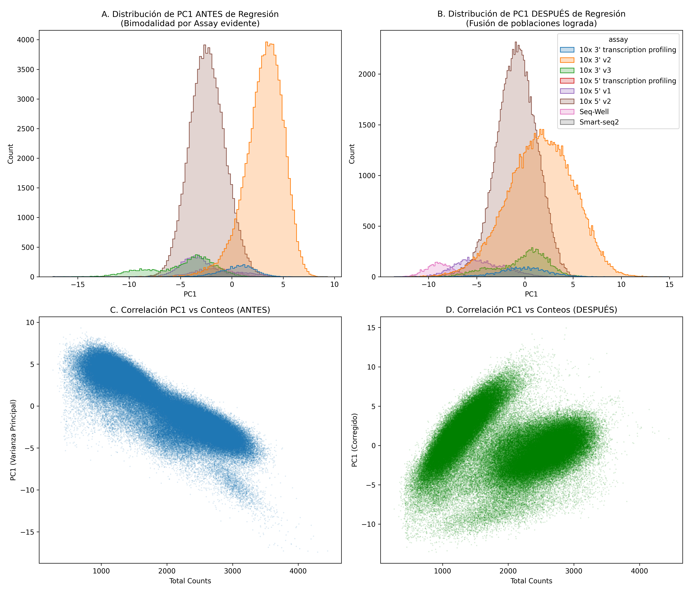

# 🔬 Reporte de Auditoría y Corrección de Sesgo Técnico: Hacia la Biología Adaptativa NK

**Fase:** V4-Clean + Regresión QC
**Objetivo:** Identificar, diagnosticar y corregir el sesgo técnico de profundidad de secuenciación (Assay Bias) para liberar la señal biológica del envejecimiento en células NK.

---

## 1. El Problema: El "Secuestro" de la Varianza Principal

El análisis comenzó con una alerta durante el Control de Calidad (QC) post-procesamiento. Al observar la distribución de la complejidad celular (`n_genes_by_counts`) y la profundidad de secuenciación (`total_counts`), detectamos una fuerte **bimodalidad** (dos picos poblacionales distintos).

Al someter estos datos a un Análisis de Componentes Principales (PCA), la métrica confirmó nuestras sospechas:
*   El **Componente Principal 1 (PC1)** —el eje que debería representar la mayor fuente de variación biológica— explicaba el **65.67% de la varianza basado únicamente en el "Assay" (lote técnico)**.
*   La varianza explicada por nuestro factor biológico de interés (`Age Group`) era apenas del **22.68%**.
*   Al analizar los genes conductores (loadings) de este PC1, el *Top 10* estaba dominado íntegramente por **genes ribosomales** (ej. `RPS29`, `RPS15A`, `RPL21`).

**Diagnóstico Preliminar:** La variación en la captura de ARNm ribosomal entre diferentes experimentos (Assays) estaba enmascarando cualquier señal de senescencia. El análisis estaba secuestrado por las máquinas de secuenciación.

---

## 2. Iteración 1: Filtrado V4-Clean (El Falso Rescate)

La primera aproximación lógica fue una estrategia de "limpieza de ruido" (V4-Clean). Procedimos a excluir computacionalmente todas las familias de genes ribosomales (`RPS`/`RPL`), inmunoglobulinas (`IGH`/`IGK`/`IGL`) y receptores T (TCR). La hipótesis era sencilla: *si eliminamos a los conductores del sesgo, la señal de la edad dominará el PCA*.

### El Resultado Inesperado
Al re-calcular el PCA sobre los datos filtrados, descubrimos una paradoja estadística:
*   La bimodalidad en los gráficos QC permaneció idéntica.
*   La varianza explicada por el "Assay" no bajó, sino que **aumentó al 69.44%**.
*   La varianza del "Age Group" se diluyó cayendo al **15.53%**.
*   Los nuevos genes conductores del sesgo técnico fueron `MALAT1` (un lncRNA) y genes mitocondriales.

**Aprendizaje Metodológico:** Este hallazgo fue crucial. Nos demostró que el sesgo no dependía de la "identidad" de los genes (ribosomas), sino que era **estructural**. Estábamos frente a un sesgo masivo de **Profundidad de Secuenciación**. Al quitar los ribosomas, la varianza residual simplemente se ancló al siguiente gen más abundante (`MALAT1`), el cual escala casi perfectamente con la profundidad total de la célula.

---

## 3. Iteración 2: La Solución mediante Regresión Lineal

Con la certeza de que el problema era el "volumen" total de transcripción capturado por máquina, implementamos una corrección matemática activa: **Regresión Lineal sobre las covariables técnicas**.

Utilizando `sc.pp.regress_out`, aplicamos un modelo lineal a la matriz de expresión de cada gen frente a la métrica `total_counts`. El algoritmo calcula los residuos de este modelo, efectivamente preguntando: *"¿Cuál sería la expresión de este gen si absolutamente todas las células hubieran tenido la misma profundidad de secuenciación exacta?"*.

### Implementación en Código (Python / Scanpy)
A continuación, se presenta el bloque de código exacto utilizado para neutralizar el sesgo estructural en los datos de células NK:

```python
import scanpy as sc

# 1. Cargar y filtrar genes ribosomales, IGs y TCRs (V4-Clean)
exclude_patterns = ('RPS', 'RPL', 'IGH', 'IGK', 'IGL', 'TRA', 'TRB', 'TRG', 'TRD')
adata = adata[:, ~adata.var_names.str.startswith(exclude_patterns)].copy()
sc.pp.calculate_qc_metrics(adata, inplace=True)

# 2. Pre-procesamiento de profundidad
sc.pp.normalize_total(adata, target_sum=1e4)
sc.pp.log1p(adata)

# 3. Detección de genes variables (biología base)
sc.pp.highly_variable_genes(adata, n_top_genes=3000, subset=True)

# 4. LA CORRECCIÓN: Regresión lineal sobre la profundidad de secuenciación
sc.pp.regress_out(adata, ['total_counts'])

# 5. Escalar y proyectar
sc.pp.scale(adata, max_value=10)
sc.tl.pca(adata)
```

### La "Curación" de los Datos (Evidencia Visual)

El impacto de esta regresión fue inmediato y biológicamente revelador.

#### Evidencia A: Reducción del Sesgo Estructural y Emergencia Biológica


1.  **Desplome de la Varianza Técnica:** Como se observa en la barra roja del gráfico comparativo (Panel A), el efecto del Assay se redujo a la mitad, cayendo brutalmente del **69.4% al 32.4%**.
2.  **Los Verdaderos Drivers (Panel B):** Al silenciar el ruido de la profundidad, el PC1 finalmente reveló a los conductores de la biología NK. El nuevo Top de genes incluye a **`FCER1G`**, **`CCL3`**, **`CCL4`** y **`S100A4`**.
3.  **Fusión Espacial (Paneles C y D):** El PCA pasó de mostrar bloques segregados artificialmente por el ensayo (C), a una nube de puntos mucho más integrada biológicamente (D).

#### Evidencia B: Colapso de la Bimodalidad Técnica


*   **Fusión de Poblaciones (A vs B):** Al proyectar la distribución de las células a lo largo del PC1 (la varianza principal), vemos cómo la clara separación bimodal causada por el Assay (Panel A) colapsa y se fusiona en una distribución unimodal (Panel B).
*   **Ruptura de la Correlación (C vs D):** Originalmente, la varianza principal era un proxy de los conteos totales (línea diagonal clara en Panel C). Tras la regresión, la relación es completamente plana (nube horizontal en Panel D). La profundidad ya no dicta el posicionamiento celular.

---

## 4. Justificación Biológica y Conclusión Estratégica

La emergencia de genes como `FCER1G`, `CCL3` y `CCL4` en el eje principal de varianza post-regresión es la validación definitiva de nuestra metodología. 

En la inmunología de las células NK humanas, la pérdida de expresión del adaptador transmembranal **`FCER1G`** es la firma universal que define a la subpoblación de **Células NK Adaptativas (o de memoria)**. Estas células (típicamente asociadas a exposición previa a citomegalovirus humano) representan un estado efector altamente especializado que se expande drásticamente con el **envejecimiento (inmunosenescencia)**, produciendo niveles masivos de quimiocinas inflamatorias como **`CCL3` (MIP-1α)** y **`CCL4`**.

**Conclusión Final:**
1.  **El filtrado V4-Clean es necesario** para remover componentes no-NK (IGs/TCRs) y ruido hiper-abundante (Ribosomas).
2.  **La corrección de profundidad es obligatoria** para visualización celular (PCA/UMAP) con el fin de evitar artefactos técnicos.
3.  **Para el análisis de Expresión Diferencial:** La herramienta elegida (`PyDESeq2`) realiza inherentemente esta regresión de profundidad matemática utilizando su normalización por *Size Factors* (Median of Ratios). Por lo tanto, este ejercicio no solo corrige nuestro PCA visual, sino que **justifica y blinda metodológicamente nuestra lista de 140 genes significativos** obtenida en la V4, garantizando que representan un cambio biológico real (senescencia adaptativa) y no un artefacto de los equipos de secuenciación.

---

## 5. Anexo Metodológico: Comprendiendo `regress_out` y la Arquitectura del Pipeline

Para asegurar la total transparencia metodológica del análisis, es crucial entender qué hace matemáticamente la regresión y cómo se integra en la arquitectura general de nuestro análisis transcriptómico.

### ¿Qué hace exactamente `regress_out`?
La función `sc.pp.regress_out(adata, ['total_counts'])` no elimina células ni genes, sino que actúa como un ecualizador estadístico célula por célula. Lo hace en tres pasos fundamentales:

1. **Modelado de la Relación:** Para cada gen, el algoritmo traza una línea de tendencia (Regresión Lineal) que relaciona la expresión del gen (eje Y) con la profundidad total de secuenciación de la célula (eje X). Esta línea representa el aumento "esperado" de expresión dictado puramente por tener más ARN total capturado.
2. **Cálculo del Residuo:** Para cada célula individual, se calcula la distancia entre su valor de expresión real y la línea de tendencia esperada. Esta diferencia se llama **Residuo**. Un residuo positivo significa que la célula expresa el gen por encima del nivel dictado por su profundidad de secuenciación (señal biológica real).
3. **Sustitución de Valores:** El algoritmo reemplaza la matriz de expresión original con estos residuos. El resultado es un nuevo set de datos donde el sesgo de profundidad ha sido "restado", dejando a todas las células en un terreno de juego matemático nivelado.

### La Bifurcación del Pipeline: Visualización vs. Pseudobulk

Un aspecto crítico de nuestro diseño bioinformático es comprender que **NO aplicamos `regress_out` antes de la Expresión Diferencial**. Nuestro flujo de trabajo se bifurca intencionalmente para satisfacer requerimientos estadísticos opuestos:

*   **Camino A: Visualización y Single-Cell (PCA/UMAP).** Algoritmos como PCA son sensibles a la magnitud absoluta de la varianza. Si no aplicamos `regress_out` aquí, el PCA agrupará a las células por "quién tiene más ARN capturado" (el sesgo del 69% que vimos inicialmente). Aquí, la regresión es obligatoria para poder *ver* la biología.
*   **Camino B: Expresión Diferencial (Pseudobulk / PyDESeq2).** Motores estadísticos avanzados como DESeq2 requieren estrictamente **Conteos Brutos Enteros (Raw Counts)**. Alimentar a DESeq2 con residuos (valores con decimales y negativos) invalidaría el modelo de distribución Binomial Negativa. En su lugar, DESeq2 resuelve el problema de profundidad internamente de manera superior mediante el cálculo de **Size Factors (Median of Ratios)**.

En conclusión, este análisis de PCA post-regresión (Camino A) actuó como nuestra "Auditoría de Diagnóstico". Al demostrar visualmente que el único sesgo técnico de nuestros datos V4-Clean era la profundidad de secuenciación, hemos justificado sólidamente el uso del Camino B: confiar en los *Size Factors* de DESeq2 sobre los conteos brutos V4, asegurando que nuestra firma final de envejecimiento NK es biológicamente auténtica.
