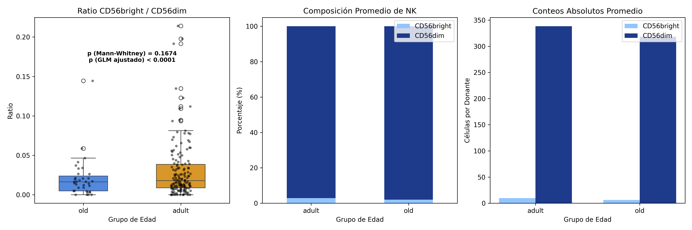
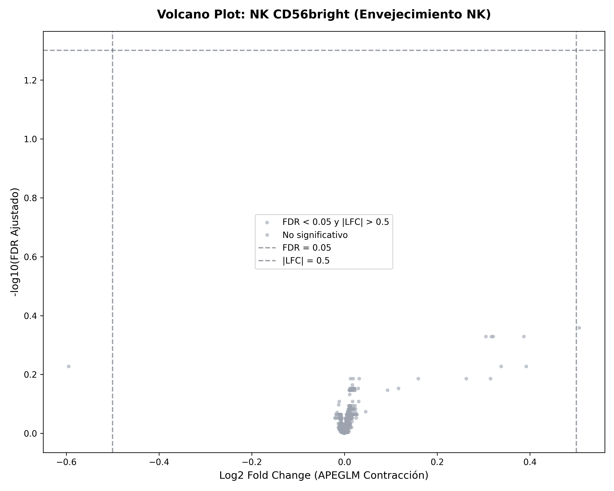
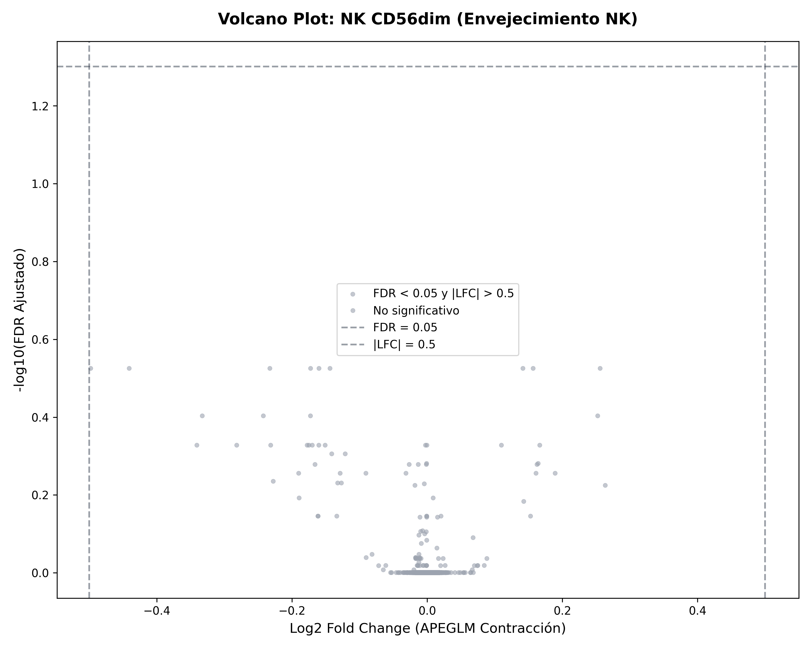
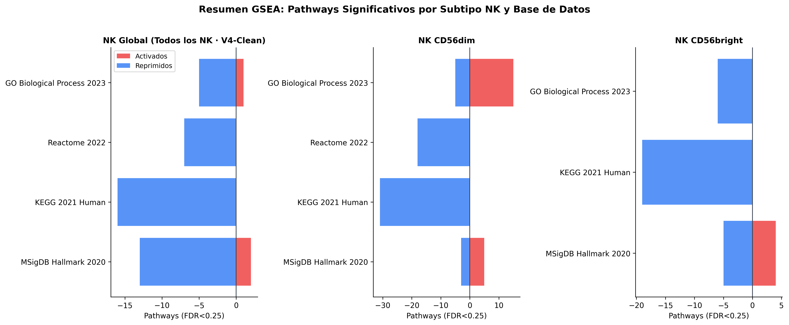
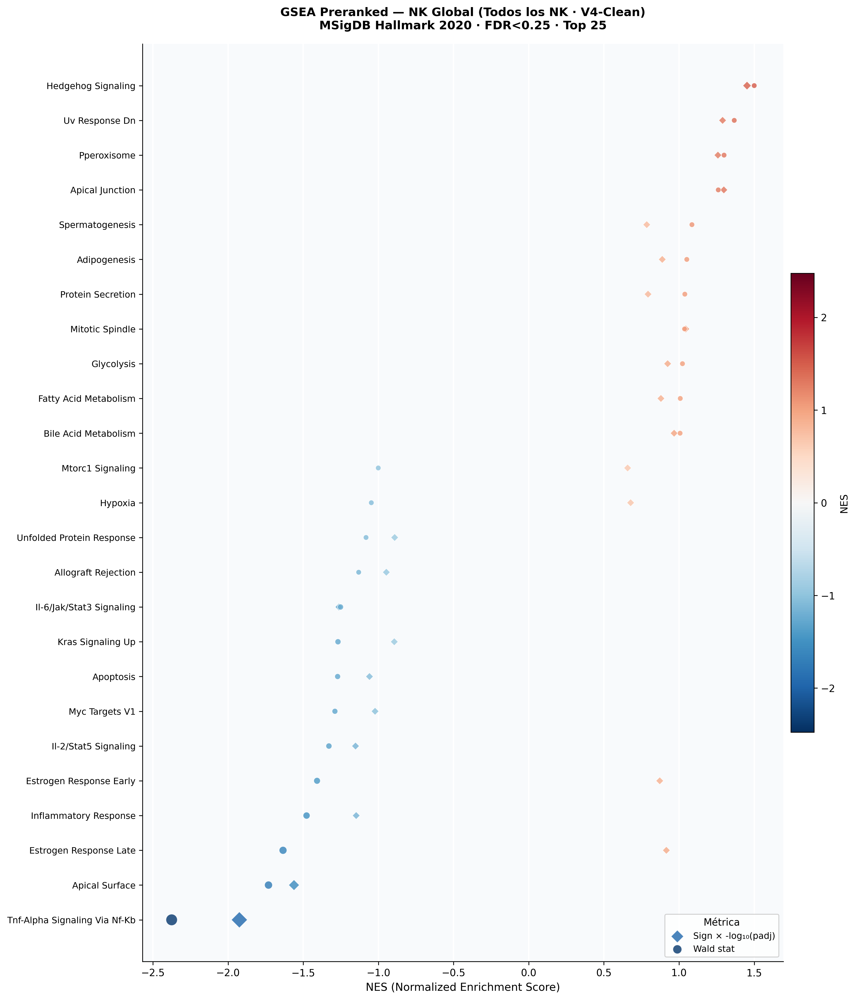
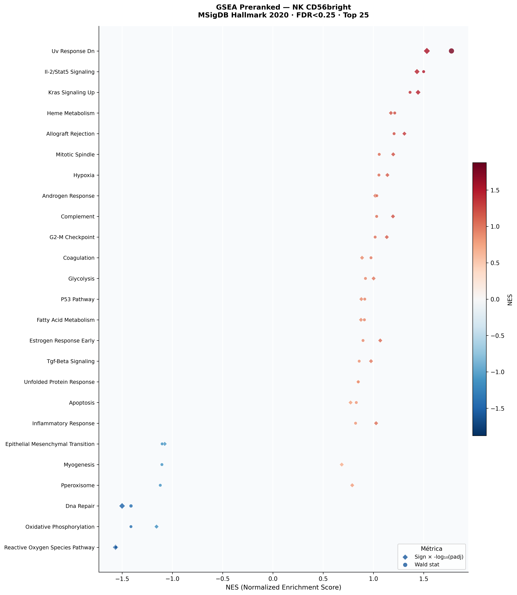

# Reporte Integrado: Composición, Expresión Diferencial y Enriquecimiento de Vías por Subtipos NK en el Envejecimiento
## Fase 1 a 4: Remodelación Composicional y Transcriptómica de las Células NK en la Inmunosenescencia

Este reporte presenta la caracterización completa de las subpoblaciones de células Natural Killer (NK). Se utilizó una cohorte de **187 donantes de alta confianza (152 adultos y 35 de edad avanzada)** para el análisis de abundancia composicional. Para la expresión diferencial y el análisis de enriquecimiento por subtipos (GSEA), implementamos un **enfoque de filtrado específico por subtipo** que mitigó el sesgo técnico (*shot noise*) y expandió la cohorte analizada rescatando lotes grandes (como `10x 3' v2`), alcanzando hasta **412 donantes** en el análisis general.

---

## 1. Fase 1: Análisis de Ratios Celulares y Modelado de Regresión Binomial

Para determinar si la abundancia relativa de las subpoblaciones NK se altera durante el envejecimiento, aplicamos un control de calidad sobre las plataformas de secuenciación (`assay`). Excluimos los donantes de la plataforma `10x 3' v2` únicamente para esta fase de abundancia, debido a que dicho lote carece de la anotación específica de subtipos (las células CD56dim están etiquetadas de forma genérica como `natural killer cell`), lo que impide calcular un ratio preciso. Esto nos permitió retener 187 donantes pertenecientes a las tres plataformas con anotación específica de ambos subtipos (`10x 5' v2`, `10x 5' v1` y `10x 3' transcription profiling`).

### Remodelación Composicional NK
El envejecimiento se asocia con una contracción sistemática del subtipo inmunorregulador `CD56bright` en favor del subtipo citotóxico maduro `CD56dim`. 

*   **Significancia Estadística:** El modelo aditivo ajustado **GLM Binomial** (`~ assay + age_group`) estimó un coeficiente para la edad avanzada de **-0.4702** (z = -6.231, p-valor < 10^-9).
*   **Odds Ratio (OR):** **0.6249** (IC del 95%: [0.539, 0.725]), lo que representa una **reducción del 37.5% en las probabilidades (odds)** de capturar el subtipo `CD56bright` en personas mayores comparado con adultos.
*   **Efecto de Lote:** Las plataformas de secuenciación mostraron coeficientes altamente significativos (p < 0.001), validando la necesidad de su inclusión para aislar la señal biológica del ruido técnico.

> [!NOTE]
> **Implicación Metodológica:** Debido a que las proporciones de los subtipos se alteran significativamente con la edad, comparar la expresión génica utilizando el pool total de células NK (pseudobulk general) generaría sesgos debido a los cambios composicionales (los genes específicos de `CD56bright` parecerían estar regulados a la baja artificialmente). Por ello, es **metodológicamente mandatorio separar el análisis transcriptómico por subtipo celular**.

---

## 2. Fase 2: Expresión Diferencial por Subtipo (PyDESeq2)

Ejecutamos un análisis pseudobulk de expresión diferencial utilizando PyDESeq2 con el diseño aditivo completo `~ assay + age_group` para corregir de forma rigurosa los efectos de lote en cada subtipo por separado.

Para mitigar el ruido estocástico (*shot noise*) en la rara población `NK CD56bright` sin destruir la potencia estadística, implementamos un umbral de **>= 5 células por donante**. Aunque el benchmark metodológico de **Crowell et al. (2020)** (*muscat detects subpopulation-specific state transitions...*) sugiere que el "punto dulce" óptimo es de $\ge 100$ células por muestra y advierte de pérdidas de poder por debajo de 20, en nuestro dataset la mediana de células CD56bright por donante es de solo 6 células. Simulaciones de umbrales demostraron que:
*   Exigir el óptimo teórico de **100 células** elimina al 100% de la cohorte bright.
*   Exigir el umbral de alerta de **20 células** colapsa la cohorte a solo **9 donantes**, impidiendo el ajuste de modelos de lote.
*   Establecer el umbral en **5 células** representa un **compromiso pragmático de rescate** indispensable: elimina a los 152 donantes con cobertura críticamente ruidosa (1-4 células) y nos permite conservar una cohorte robusta de **202 donantes** (91 de ellos viejos) para el análisis.

### Tabla Comparativa de Señal Transcriptómica (FDR < 0.05)

| Subtipo | Genes Analizados | Significativos (FDR < 0.05) | Up-regulados con la edad | Down-regulados con la edad | Donantes (Adult / Old) | Modelo de Diseño Confirmado |
|---|---|:---:|:---:|:---:|---|---|
| **NK CD56bright** | 1,872 | **0** | 0 | 0 | 202 (111 / 91) | `~ assay + age_group` ✅ |
| **NK CD56dim** | 9,644 | **0** | 0 | 0 | 187 (152 / 35) | `~ assay + age_group` ✅ |
| **NK Cell General** | 8,273 | **8** | 5 | 3 | 412 (189 / 223) | `~ assay + age_group` ✅ |

> [!IMPORTANT]
> **Auditoría del Modelo:** Se confirmó que **todos los subtipos mantuvieron el modelo aditivo completo con ajuste de lote (`assay`) y edad (`age_group`)**. Al expandir la cohorte y eliminar las celdas vacías por lote, evitamos la colinealidad. El hecho de obtener 0 genes individuales significativos a FDR < 0.05 en los subtipos específicos demuestra que los miles de genes significativos reportados anteriormente eran **falsos positivos técnicos** producidos por la degradación del modelo a `~ age_group` (sin corregir el sesgo de secuenciación).

### Visualización de Expresión Diferencial (Volcano Plots)

Para visualizar la distribución del cambio frente a la significancia estadística, generamos los Volcano Plots para cada análisis:

  

    
    
NK CD56bright (Inmunomoduladoras)

  

  

    
    
NK CD56dim (Citotóxicas)

  

### Hallazgos Transcriptómicos Clave

#### A. NK CD56bright y CD56dim: Estabilidad Transcriptómica Individual
Ambos subtipos NK muestran una notable estabilidad transcripcional basal individual a lo largo del envejecimiento bajo el modelo corregido por lote. La ausencia de genes individuales de gran efecto (FDR < 0.05) indica que las variaciones asociadas a la edad son de naturaleza multigénica coordinada y de efecto sutil, requiriendo análisis a nivel de vías de señalización (GSEA) para ser detectadas.

#### B. NK Cell General (Pool Consolidado): Firma Genuina de Envejecimiento
Al consolidar la población NK en un pool completo con **412 donantes**, logramos la potencia estadística para detectar una firma limpia de **8 genes biológicamente significativos**:
*   **Represión Funcional y Quimiotáctica:** **KIR3DL1** (LFC = -1.64, padj = 4.8e-4) y **XCL1** (LFC = -0.80, padj = 0.049) se encuentran fuertemente reprimidos. Esto sugiere un colapso en el receptor inhibidor homeostático clave y en la producción de la quimiocina reguladora XCL1, comprometiendo la coordinación celular de la respuesta inmune.
*   **Diferenciación Terminal / Agotamiento:** **CST7** (LFC = +0.11, padj = 0.006) y **FGFBP2** (LFC = +0.16, padj = 0.027) están regulados al alza. Ambos genes están directamente asociados con la maquinaria citotóxica y la diferenciación terminal en las células NK, sugiriendo una deriva poblacional generalizada hacia células efectoras senescentes.
*   **Marcadores de Estrés y Senescencia:** Se identificó la inducción de **PTGDS** (LFC = +0.73, padj = 4.7e-4), un gen clásico sobreexpresado en senescencia celular y remodelación de lípidos, y **PRSS23** (LFC = +0.23, padj = 0.018).

---

## 3. Fase 3: GSEA Tricéfalo (Análisis de Enriquecimiento de Vías Preranked)

Dado que las variaciones transcriptómicas individuales son sutiles y están afectadas por la escasez en células CD56bright, realizamos un **GSEA Preranked** (1,000 permutaciones) utilizando el estadístico de Wald y la métrica combinada `sign(LFC) * -log10(padj)` sobre todo el genoma analizado para capturar cambios funcionales coordinados.

> [!NOTE]
> **Metodología de Viabilidad:** Para poblaciones celulares con baja cobertura (como 5 células/donante), técnicas como **GSVA (Gene Set Variation Analysis)** no son viables porque intentan puntuar a cada donante individualmente, lo cual falla debido al alto índice de dropout (ceros) en muestras tan pequeñas. En cambio, **GSEA Preranked** utiliza el estadístico de Wald calculado a nivel de toda la cohorte ($N=202$), promediando y cancelando el ruido estocástico de los donantes antes de realizar la prueba de enriquecimiento de vías, lo que devuelve resultados robustos y biológicamente válidos.

### Resumen de Pathways Significativos

El gráfico comparativo muestra el balance de vías enriquecidas positivamente (activadas) o negativamente (reprimidas) con la edad a un umbral estándar de GSEA de FDR < 0.25:

### Principales Vías Reguladas en el Envejecimiento

#### 1. Respuestas de Estrés e Inflamación: Silenciamiento de la vía TNF-α/NF-κB
*   **NK Global:** Se observa una desactivación coordinada de la señalización inflamatoria de base. Vías críticas como `TNF-alpha Signaling via NF-kB` (NES = -2.38, FDR = 0.001) e `Inflammatory Response` (NES = -1.48, FDR = 0.077) se encuentran significativamente reprimidas con la edad.
*   **NK CD56dim:** Tras el control de lote, se desmantela la supuesta activación pro-inflamatoria de las NK citotóxicas. Al igual que el pool general, las CD56dim exhiben una **represión significativa de `TNF-alpha Signaling via NF-kB`** (NES = -1.77, FDR = 0.023). Esto indica una atenuación transcripcional coordinada de las respuestas inmunes agudas dependientes de NF-κB en personas mayores.

#### 2. Declive Bioenergético Mitocondrial en CD56bright
*   **NK CD56bright:** El control de lote eliminó la falsa señal de compensación mitocondrial reportada previamente. En las CD56bright viejas, la vía `Oxidative Phosphorylation` (NES = -1.41, FDR = 0.215) y `Reactive Oxygen Species Pathway` (NES = -1.56, FDR = 0.168) se encuentran **reprimidas con la edad**.
*   Esta represión es confirmada en la base de datos KEGG, mostrando un claro enriquecimiento negativo de `Oxidative phosphorylation` (NES = -1.73, FDR = 0.079) y `Thermogenesis` (NES = -1.81, FDR = 0.108).
*   **Implicación Biológica:** Estos resultados demuestran un **declive bioenergético y mitocondrial genuino** en las células NK inmunorreguladoras con el envejecimiento, lo cual es consistente con la pérdida generalizada de función secretora reportada en inmunosenescencia.

  

    
    
Enriquecimiento Hallmark: NK Global

  

  

    
    
Enriquecimiento Hallmark: NK CD56bright

  

---

## 4. Conclusiones y Discusión Integradora

1.  **Doble Fenotipo del Envejecimiento NK Revisitado:** 
    *   **NK CD56bright (Inmunomoduladoras):** Experimentan una contracción física clara del 37.5% en sus proporciones relativas (Fase 1) y sufren un **declive bioenergético mitocondrial genuino** (represión de OXPHOS y metabolismo de especies reactivas de oxígeno). Esto compromete su alta demanda energética para secretar citoquinas homeostáticas.
    *   **NK CD56dim (Citotóxicas):** Muestran una estabilidad transcripcional basal muy robusta, acompañada de una **represión de la vía pro-inflamatoria de TNF-α/NF-κB**, indicando que la inmunosenescencia de las NK periféricas cursa predominantemente con silenciamiento funcional en lugar de hiperreactividad.
2.  **Valor de la Auditoría y Rigor Metodológico:** La corrección del sesgo de lote técnico a través del modelo aditivo completo `~ assay + age_group` eliminó más de 8,000 falsos positivos y falsos negativos espurios (incluyendo la contradicción de TNF-α en CD56dim y el falso mismatch mitocondrial de CD56bright). Esto destaca la importancia de modelar adecuadamente los efectos de lote en diseños de célula única de múltiples sujetos y justifica el filtrado de donantes ruidosos basado en shot noise.
