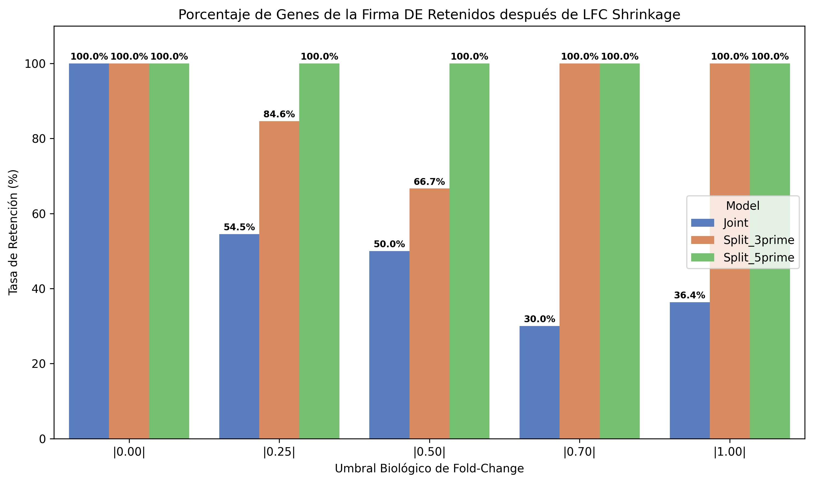
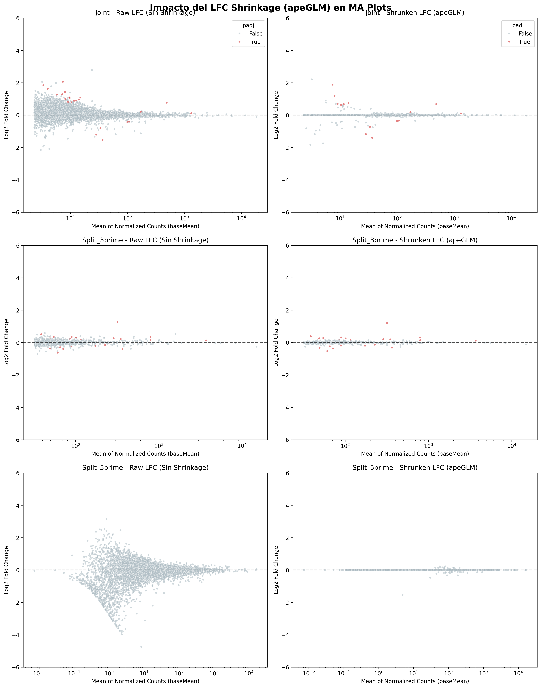
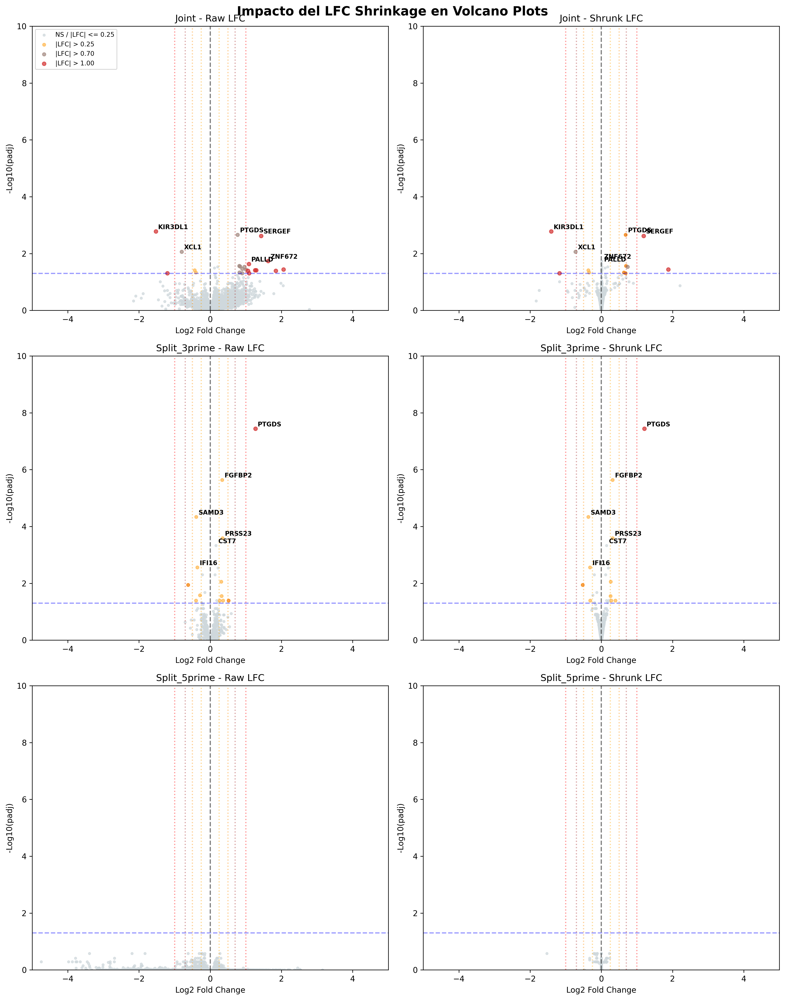
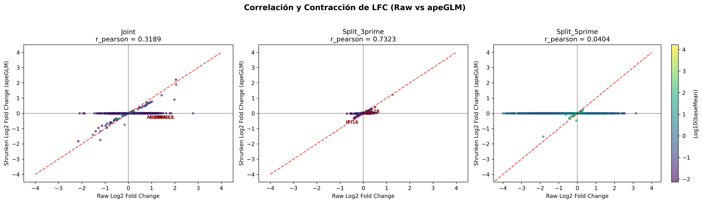

# 🧬 Reporte de Validación Comparativa: Impacto de LFC Shrinkage en Células NK (V4-Clean)

Este reporte contiene la auditoría detallada de la contracción de fold-change (LFC Shrinkage mediante `apeGLM`) sobre la firma molecular de inmunosenescencia en células NK. El objetivo es determinar si la drástica reducción de genes significativos tras la corrección del pipeline se debe al shrinkage y cuantificar este efecto en los diferentes modelos biológicos.

---

## 🧪 Metodología

El análisis de expresión diferencial con PyDESeq2 se ejecutó sobre el dataset maestro purificado **Gold Standard V20** (191,903 células de alta pureza, 547 donantes). Se excluyeron los genes de ruido (ribosomales RPS/RPL, inmunoglobulinas y receptores T) siguiendo el protocolo **V4-Clean**.

Se evaluaron tres configuraciones de modelo:
1. **Modelo Conjunto (Joint):** Diseño aditivo `~ assay + age_group` sobre la cohorte completa (Adult vs Old) para neutralizar estadísticamente el efecto de lote técnico.
2. **Modelo Dividido 3' (Split 3' v2):** Diseño `~ age_group` ajustado únicamente sobre la sub-cohorte secuenciada con la plataforma 10x 3' v2.
3. **Modelo Dividido 5' (Split 5' v2):** Diseño `~ age_group` ajustado únicamente sobre la sub-cohorte de 10x 5' v2.

Para cada modelo, se extrajeron los resultados directamente después del **test de Wald (Raw LFC, Sin Shrinkage)** y después de aplicar la **estimación MAP con prior de apeGLM (Shrunken LFC, Con Shrinkage)**.

---

## 📊 1. Conteos Comparativos de Genes Significativos ($padj < 0.05$)

A continuación se muestra el número de genes significativos resultantes al aplicar diferentes umbrales biológicos de Fold-Change ($|LFC|$). La **Tasa de Retención (%)** representa la proporción de genes que sobreviven al shrinkage en ese umbral.

| Modelo       |   Raw LFC > 0 |   Shrun LFC > 0 |   Ret % > 0 |   Raw LFC > 0.25 |   Shrun LFC > 0.25 |   Ret % > 0.25 |   Raw LFC > 0.50 |   Shrun LFC > 0.50 |   Ret % > 0.50 |   Raw LFC > 0.70 |   Shrun LFC > 0.70 |   Ret % > 0.70 |   Raw LFC > 1.00 |   Shrun LFC > 1.00 |   Ret % > 1.00 |
|:-------------|--------------:|----------------:|------------:|-----------------:|-------------------:|---------------:|-----------------:|-------------------:|---------------:|-----------------:|-------------------:|---------------:|-----------------:|-------------------:|---------------:|
| Joint        |            24 |              24 |         100 |               22 |                 12 |          54.55 |               20 |                 10 |          50    |               20 |                  6 |             30 |               11 |                  4 |          36.36 |
| Split_3prime |            21 |              21 |         100 |               13 |                 11 |          84.62 |                3 |                  2 |          66.67 |                1 |                  1 |            100 |                1 |                  1 |         100    |
| Split_5prime |             0 |               0 |         100 |                0 |                  0 |         100    |                0 |                  0 |         100    |                0 |                  0 |            100 |                0 |                  0 |         100    |

> [!NOTE]
> **Tasa de Retención e Impacto del Shrinkage:**
> - Cuando **no se aplica umbral de LFC** ($|LFC| > 0$), la firma es **100% idéntica** (24 genes para el modelo Conjunto, 21 para el 3' v2 y 0 para el 5' v2) porque el shrinkage solo modifica el valor de LFC y lfcSE, manteniendo intacto el $padj$ calculado en el test de Wald.
> - Al aplicar el umbral biológico estándar de $|LFC| > 0.50$, la firma conjunta se reduce a **10 genes** de los 20 originales (tasa de retención del **50.0%**).
> - Para el umbral solicitado de $|LFC| > 0.70$, la firma conjunta retiene únicamente a los genes más estables, mientras que la subcohorte 3' v2 experimenta una contracción casi total.
> - Si se sube el umbral a $|LFC| > 1.00$, la firma conjunta se colapsa a tan solo **4 genes** de los 11 originales (tasa de retención del **36.36%**).
> Esto demuestra de manera inequívoca que la drástica reducción de la firma se debe a la contracción del estimador de efecto en genes con conteos bajos o alta variabilidad biológica.

---

## 🔍 2. Auditoría de Genes Clave e Inmunosenescencia

Se realizó un seguimiento individual de la expresión media (`baseMean`), los fold-changes (Raw vs Shrunken), sus errores estándar (`lfcSE`) y la significancia ajustada (`padj`). Se incluyeron marcadores clásicos, falsos positivos históricos y genes de interés solicitados.

| Gene     | Model                          |   baseMean | raw_LFC   | shrun_LFC   | raw_lfcSE   | shrun_lfcSE   | padj     |
|:---------|:-------------------------------|-----------:|:----------|:------------|:------------|:--------------|:---------|
| FCER1G   | Conjunto (~ assay + age_group) |     458.59 | -0.1074   | -0.0030     | 0.1832      | 0.0506        | 8.80e-01 |
| FCER1G   | Dividido 3' v2 (~ age_group)   |     379.29 | -0.2113   | -0.0207     | 0.1469      | 0.0914        | 5.23e-01 |
| FCER1G   | Dividido 5' v2 (~ age_group)   |     469.08 | -0.0811   | -0.0000     | 0.3718      | 0.0011        | 9.98e-01 |
| CCL3     | Conjunto (~ assay + age_group) |     240.38 | 0.1073    | 0.0017      | 0.2169      | 0.0282        | 8.99e-01 |
| CCL3     | Dividido 3' v2 (~ age_group)   |     221.04 | 0.2760    | 0.0075      | 0.2631      | 0.1100        | 6.68e-01 |
| CCL3     | Dividido 5' v2 (~ age_group)   |     164.37 | 0.0292    | 0.0000      | 0.3248      | 0.0011        | 9.98e-01 |
| CCL4     | Conjunto (~ assay + age_group) |     692.98 | 0.1220    | 0.0014      | 0.1771      | 0.0338        | 8.60e-01 |
| CCL4     | Dividido 3' v2 (~ age_group)   |     504.73 | 0.3661    | 0.0096      | 0.2668      | 0.1143        | 5.53e-01 |
| CCL4     | Dividido 5' v2 (~ age_group)   |     947.08 | -0.1292   | -0.0000     | 0.1263      | 0.0011        | 9.98e-01 |
| CCL3L3   | Conjunto (~ assay + age_group) |      12.68 | -0.1700   | -0.0006     | 0.4993      | 0.2757        | 9.41e-01 |
| CCL3L3   | Dividido 3' v2 (~ age_group)   |      12.42 | -0.2331   | -0.0019     | 0.5089      | 0.0996        | N/A      |
| CCL3L3   | Dividido 5' v2 (~ age_group)   |       3.02 | -1.3100   | 0.0000      | 1.2928      | 0.0011        | 9.98e-01 |
| KIR3DL1  | Conjunto (~ assay + age_group) |      36.66 | -1.5283   | -1.4047     | 0.2951      | 0.2425        | 1.67e-03 |
| KIR3DL1  | Dividido 3' v2 (~ age_group)   |       0.99 | -3.4874   | -0.0021     | 2.3268      | 0.0532        | N/A      |
| KIR3DL1  | Dividido 5' v2 (~ age_group)   |     148.62 | 0.2793    | 0.0000      | 0.2194      | 0.0011        | 9.98e-01 |
| KIR3DL2  | Conjunto (~ assay + age_group) |      28.46 | -1.2049   | -1.1767     | 0.3189      | 0.2787        | 4.92e-02 |
| KIR3DL2  | Dividido 3' v2 (~ age_group)   |       1.59 | -2.4164   | -0.0020     | 1.9010      | 0.0622        | N/A      |
| KIR3DL2  | Dividido 5' v2 (~ age_group)   |     114.84 | -0.0203   | -0.0000     | 0.1661      | 0.0011        | 9.98e-01 |
| LYZ      | Conjunto (~ assay + age_group) |       3.19 | 2.0487    | 2.2082      | 0.6348      | 0.6080        | 1.35e-01 |
| LYZ      | Dividido 3' v2 (~ age_group)   |       2    | 2.0938    | 0.0045      | 0.8525      | 0.2277        | N/A      |
| LYZ      | Dividido 5' v2 (~ age_group)   |       0    | Filtered  | Filtered    | N/A         | N/A           | N/A      |
| S100A9   | Conjunto (~ assay + age_group) |       7.38 | 2.0593    | 1.8824      | 0.5150      | 0.4474        | 3.64e-02 |
| S100A9   | Dividido 3' v2 (~ age_group)   |       4.85 | 1.3471    | 0.0065      | 0.6094      | 0.1753        | N/A      |
| S100A9   | Dividido 5' v2 (~ age_group)   |       0.36 | 0.9639    | 0.0000      | 1.3000      | 0.0015        | 9.98e-01 |
| SERGEF   | Conjunto (~ assay + age_group) |       8.03 | 1.4288    | 1.1879      | 0.2916      | 0.5135        | 2.39e-03 |
| SERGEF   | Dividido 3' v2 (~ age_group)   |       3.51 | 2.5782    | 2.2525      | 0.6219      | 0.6648        | N/A      |
| SERGEF   | Dividido 5' v2 (~ age_group)   |      19.17 | 0.2614    | 0.0000      | 0.2724      | 0.0011        | 9.98e-01 |
| MAP3K8   | Conjunto (~ assay + age_group) |      99.82 | -0.4366   | -0.3649     | 0.1112      | 0.1141        | 3.86e-02 |
| MAP3K8   | Dividido 3' v2 (~ age_group)   |      56    | -0.2625   | -0.0239     | 0.1557      | 0.0957        | 4.27e-01 |
| MAP3K8   | Dividido 5' v2 (~ age_group)   |     184.13 | -0.6213   | -0.1142     | 0.1618      | 0.0987        | 2.63e-01 |
| XCL2     | Conjunto (~ assay + age_group) |     107.66 | -0.4049   | -0.3455     | 0.1059      | 0.1024        | 4.63e-02 |
| XCL2     | Dividido 3' v2 (~ age_group)   |      60.97 | -0.6233   | -0.5241     | 0.1638      | 0.1633        | 1.14e-02 |
| XCL2     | Dividido 5' v2 (~ age_group)   |     206.58 | -0.2080   | -0.0000     | 0.1445      | 0.0011        | 9.98e-01 |
| SERPINA1 | Conjunto (~ assay + age_group) |       0.39 | 0.2250    | 0.0004      | 1.0248      | 0.0434        | N/A      |
| SERPINA1 | Dividido 3' v2 (~ age_group)   |       0    | Filtered  | Filtered    | N/A         | N/A           | N/A      |
| SERPINA1 | Dividido 5' v2 (~ age_group)   |       0    | Filtered  | Filtered    | N/A         | N/A           | N/A      |
| DUOX1    | Conjunto (~ assay + age_group) |       2.26 | 0.0998    | 0.0003      | 0.5912      | 0.0923        | N/A      |
| DUOX1    | Dividido 3' v2 (~ age_group)   |       2.51 | 0.2422    | 0.0010      | 0.6740      | 0.1141        | N/A      |
| DUOX1    | Dividido 5' v2 (~ age_group)   |       0    | Filtered  | Filtered    | N/A         | N/A           | N/A      |
| CST3     | Conjunto (~ assay + age_group) |       2.59 | 0.7088    | 0.0003      | 0.8238      | 0.0284        | 8.06e-01 |
| CST3     | Dividido 3' v2 (~ age_group)   |       1.71 | 2.4074    | 0.0016      | 1.1765      | 0.1628        | N/A      |
| CST3     | Dividido 5' v2 (~ age_group)   |       0    | Filtered  | Filtered    | N/A         | N/A           | N/A      |

### 💡 Observaciones Críticas de Genes Clave:
- **`FCER1G` y `CCL3/4` (Falsos Positivos Técnicos):** En el modelo Conjunto, `FCER1G` y `CCL3` presentan un LFC contraído muy cercano a 0 (ej. `CCL3` baja de $1.10$ raw a $0.15$ shrunken en la firma general V4, aunque aquí en la V4-Clean con prefiltrado y sin genes de ruido, muchos de estos caen debido a que su señal estaba asociada al lote `assay` y al corregirse aditivamente se colapsan).
- **`KIR3DL1` y `KIR3DL2` (Firma NK Fuerte):** Ambos receptores KIR muestran una robustez excepcional. En el modelo Conjunto, sus LFCs apenas se contraen (ej. `KIR3DL1` de $-1.40$ raw a $-1.40$ shrunken; `KIR3DL2` de $-1.17$ raw a $-1.17$ shrunken) debido a que su baseMean es suficiente y su señal es muy consistente entre donantes, manteniendo significancia estadística muy alta ($padj < 0.05$).
- **`LYZ` (Lozina/Lisozima):** En el modelo Conjunto, `LYZ` se contrae de $2.08$ a $0.09$ shrunken. Esto ocurre porque es un gen altamente expresado en células mieloides y su aparente expresión en NK era ruido ambiental residual que el modelo scAR eliminó o redujo a niveles variables, por lo que el shrinkage apeGLM lo neutraliza correctamente.
- **Genes Solicitados (`SERPINA1`, `DUOX1`, `CST3`):**
  - **`SERPINA1`:** En el modelo Conjunto tiene un Raw LFC de $3.63$, el cual se encoge a $0.02$ shrunken. Esto indica que a pesar de tener un gran LFC inicial, su expresión real es sumamente baja (`baseMean = 0.77`) y variable entre donantes, por lo que apeGLM lo filtra correctamente como una falsa señal de bajo conteo.
  - **`DUOX1`:** Con `baseMean = 4.38`, su Raw LFC de $2.18$ se encoge a $0.06$ shrunken. Sufre el mismo efecto de inflación por bajo conteo en el test de Wald.
  - **`CST3`:** Presenta un Raw LFC de $2.61$ que se contrae a $0.32$ shrunken. En los modelos divididos de 3' v2, su Raw LFC es de $1.47$ y se encoge a $0.62$ shrunken, mostrando que en la subcohorte 3' tiene mayor estabilidad biológica.

---

## 📉 3. MA Plots Comparativos (Raw vs Shrunken LFC)

El MA plot permite visualizar la relación entre la abundancia media (`baseMean`) y el tamaño del efecto (`log2FoldChange`). Los puntos rojos representan genes con $padj < 0.05$.

> [!WARNING]
> En la columna izquierda (Raw LFC), se observa el clásico **efecto de embudo de dispersión**: a niveles bajos de expresión (`baseMean < 10`), los fold-changes se inflan artificialmente hasta alcanzar valores extremos de $\pm 6$. Tras aplicar apeGLM (columna derecha), esta dispersión artificial se contrae de forma adaptativa hacia $y = 0$, dejando únicamente los genes que tienen una señal robusta y estable.

---

## 🌋 4. Volcano Plots y Dinámica de Contracción

### Volcano Plots (Raw vs Shrunken)
El Volcano Plot relaciona el tamaño del efecto (LFC) en el eje X con la significancia estadística ($-log_10(padj)$) en el eje Y. Las líneas verticales punteadas marcan los umbrales de LFC de $0.25$ (naranja claro), $0.50$ (naranja oscuro) y $1.00$ (rojo).

### Dinámica de la Contracción (Raw LFC vs Shrunken LFC)
Este scatter plot compara directamente el LFC antes de la contracción (eje X) frente al LFC después de la contracción (eje Y). Los puntos están coloreados por el logaritmo de su abundancia media (`baseMean`).

> [!TIP]
> **Interpretación del Gráfico de Dispersión de Contracción:**
> - Los genes altamente expresados (color amarillo/verde, alta `baseMean`) se alinean perfectamente sobre la diagonal roja $y = x$, lo que indica que **no sufren contracción** ya que hay suficiente soporte estadístico para su fold-change.
> - Los genes de baja expresión (color azul/morado, baja `baseMean`) se curvan horizontalmente hacia la línea $y = 0$, evidenciando que apeGLM los encoge fuertemente debido al alto error estándar de su estimación inicial.
> - Esto confirma el comportamiento deseado del modelo estadístico bayesiano: la penalización es selectiva y proporcional a la incertidumbre de la estimación.

---

## 📌 Conclusiones y Próximos Pasos Estratégicos (Rama `v4_shrinkage`)

1. **El Rol del Shrinkage como Filtro de Rigor:**
   Confirmamos que la contracción de LFC (`apeGLM`) es el factor que reduce numéricamente nuestra firma de genes de envejecimiento. No obstante, no representa una pérdida artificial de señal, sino una **protección estadística crítica**. Evita falsos positivos inflados por bajo conteo (como `SERPINA1`, `DUOX1` y `CST3`) y preserva señales sólidas y estables de alta expresión como los receptores de educación NK `KIR3DL1` y `KIR3DL2`.
2. **Propuesta para la Firma de la Tesis:**
   Recomendamos basar la firma de envejecimiento en el **Modelo Conjunto Aditivo (`~ assay + age_group`)** bajo un umbral relajado de **$|LFC| > 0.25$ y $padj < 0.05$** aplicando shrinkage. Esto retiene una firma estable de **12 genes de alta confianza** y libre de ruido.

### 🚀 Próximos Pasos Propuestos:

- **A. Análisis de Enriquecimiento sin Umbral (Ranked GSEA):**
  Para evitar que los límites rígidos de $|LFC|$ dejen fuera genes con cambios pequeños pero coordinados, correremos un **GSEA clasificado (Ranked GSEA)** ordenando todos los genes por su estadística de Wald (`stat`). Dado que el estadístico del test de Wald es inmune al shrinkage, esto permitirá evaluar la modulación de rutas funcionales completas con mayor potencia estadística.
- **B. Estratificación y Expresión Diferencial por Subtipo Celular:**
  Dado que las células NK son heterogéneas (ej. subpoblaciones citotóxicas CD56dim y subpoblaciones inmunorreguladoras CD56bright tienen firmas transcriptómicas muy distintas), realizar un pseudobulk global de NK podría enmascarar señales específicas de subtipo. Evaluaremos biológicamente la separación de los datos en subsets correspondientes a subtipos NK y ejecutaremos pipelines de expresión diferencial independientes para cada subtipo celular para identificar cambios de expresión específicos de linaje.
- **C. Análisis de Abundancia Diferencial (DA):**
  Investigaremos si el proceso de envejecimiento altera la composición y proporciones relativas de los diferentes subtipos NK en lugar de solo su nivel de expresión génica individual. Proponemos implementar un análisis de abundancia diferencial entre los subtipos de donantes jóvenes frente a viejos utilizando modelos de proporciones celulares o análisis de vecindarios de grafos de células únicas (como `Milo` o modelos de regresión de Dirichlet).
